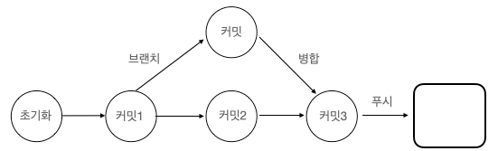
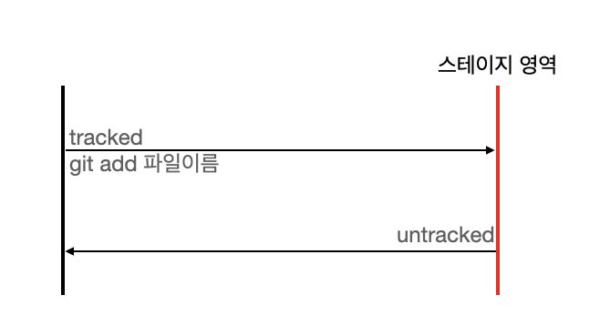
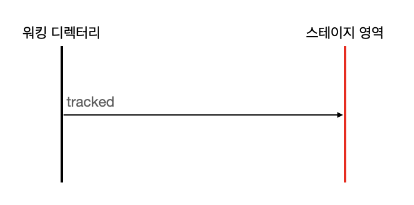

# 깃과 버전 관리
- git은 2005년 리눅스 개발자인 리누스 베네딕트 토르발스가 개발함.
- 대표적인 `분산형 버전 관리 시스템` 
    - 집중형 시스템과 달리 저장소가 여러 개 있고, 여러 저장소에 각 버전별 소스를 개별 보관한다.
    - 분산 저장소는 P2P(Peer-to-Peer)방식으로 공유하며, 각 개발자에게 공유 가능한 저장소 사본을 제공한다.
    - 서버는 각 저장소 자료를 동기화하고 중개하는 역할만 수행한다. 따라서 메인 서버에 문제가 생기더라도 지속적으로 개발할 수 있다.
## 깃의 다섯 단계

- 초기화 : 폴더를 깃 저장소로 변경
- 커밋 : 변경된 코드의 이력을 기록
- 브랜치 : 분리 격리된 코드 이력을 기록
- 병합 : 기존 이력과 분리된 이력을 통합
- 푸시 : 로컬 저장소의 이력을 서버로 전송 및 공유

# 깃 개념잡기
## 워킹 디렉터리
- `워킹 디렉터리(working directory)`는 다른 용어로 `워킹 트리(working tree)`라고도 한다.
- 깃은 VCS의 특성 때문에 저장공간을 논리적으로 분리한다.
  - 저장 공간을 크게 `작업을 하는 공간(working)`, `임시로 저장하는 공간(stage)`, `실제로 저장하여 기록하는 공간(repository)`으로 나눈다.
- 워킹 디렉터리는 `작업을 하는 공간`을 의미한다. 말 그대로 로컬 저장소에 접근할 수 있으며, 실제로 파일을 생성하고 수정하는 공간이다.
- 단순하게 파일을 저장하는 공간이라고 생각하면 된다.

## 파일의 untracked 상태와 tracked 상태
깃이 다른 VCS보다 뛰어난 것은 지정된 파일들의 모든 것을 추적하는 관리 시스템이기 때문이다. 깃은 워킹 디렉터리에 있는 파일들을 `추적됨`과 `추적되지 않음`상태로 구분한다.
  
  
**untracked 상태**   
- 실제 작업 중인 파일은 워킹 디렉터리 안에 있다.
- 워킹 디렉터리는 현재 작업 중인 소스 코드를 담고 있으며, 운영체제도 워킹 디렉터리 안에 있는 파일들만 접근하고 수정할 수 있다.
- 워킹 디렉터리는 사용자 작업 공간이라고 생각하면 된다. 이 공간에 파일을 추가하거나 수정했다고 해서 깃이 자동으로 관리해 주지는 않는다.
- 워킹 디렉터리에 새로 생성된 파일은 모두 **untracked**(추적되지 않음) 상태이다. 이 파일을 관리하려면 깃에 추적하라고 통지해 주어아한다.

**tracked 상태**   
워킹 디렉터리에 새 파일을 추가하면  `추적되지 않음(untracked)`상태이다. 워킹 디렉터리 안에 추적되이 않은 상태의 파일들은 별도의 명령어를 실행하여 `tracked(추적) 상태`로 변경해 주어야 한다. 이때는 `git add 명령어를 사용`한다.      

  

깃은 요청 받은 파일들만 **추적 관리**한다. 깃 입장에서 어떤파일이 정말로 추적 관리가 필요한지 알 수 없고, 그렇다고 해서 모든 파일을 추적 관리하기에는 과부하가 걸리기 쉽다.
따라서 추적하는 파일들을 tracked 상태로 표시한다.    

## 스테이지
깃은 여러 단계의 논리적인 저장 공간을 가지고 있다. 스테이지(stage)는 **임시로 저장하는 공간**을 의미한다. 스테이지 영역은 워킹 디렉터리에서 제출된 **tracked 파일들을 관리**한다.  

### 스테이지 = 임시영역*
스테이지는 워킹 디렉터리와 '실제로 저장하여 기록하는 공간' 사이에 잇는 **임시 영역**이다. 깃은 워킹 디렉터리에서 작업이 끝난 파일을 스테이지로 잠시 복사한다.  
스테이지가 임시 영역이라고 해서 파일의 콘텐츠 내용을 직접 가지고 있지는 않고, 단지 커밋하려는 파일의 추적 상태정보들만 기록한다.

    
이처럼 임시 영역인 스테이지를 별도로 운영하는 것은 커밋을 빠르게 처리하기 위해서이다.  
`실제로 저장하여 기록하는 공간`인 저장소는 스테이지 영역에서 가리키는 파일 내용을 기반으로 변경된 차이점만 기록한다.  
파일들의 스테이지 상태는 `status`로 확인 가능 하다.  
   
스테이지 영역에 등록된 파일들은 또 다시 stage 상태와 unstage 상태로 구분된다. 버전 관리에서 제외하고 싶은 파일이 있다면 `.gitignore`파일에 등록한다.   
   
### 파일의 stage 상태와 unstage 상태
스테이지 영역으로 등록된 모든 파일은 untracked 상태에서 tracked 상태로 변경된다.  
스테이지는 워킹 디렉터리 안에 있는 파일들의 추적 상태를 관리하는 역할을 수행한다.
- 깃이 변화 이력을 기록하려면 파일들의 **최종 상태가 stage 상태** 여야 한다.
- unstage 상태라면 파일에 변화가 있다는 것을 의미하고, 스테이지 영역에 있는 파일과 워킹 디렉터리 안에 있는 **파일 내용에 차이가 있을때 `unstage`상태**가 된다
- 넓게 보면 아직 스테이지 영역으로 등록하지 않은 워킹 디렉터리 안의 파일도 unstage 상태라고 생각할수 있고, 이때는 unstage 상태이자 동시에 untracked 상태이다.  

### 파일의 modified 상태와 unmodified 상태