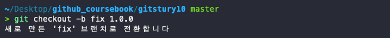

# 배포관리와 태그 

## 배포

프로그램을 개발한 후에는 완성된 결과물을 최종 사용자에게 전달해야 한다. 이때 최종 사용자에게 전달하는 과정을 `배포`라고 한다.         
개발을 완료했다고 해서 결과물을 직접 사용자에게 배포할 수 없다. 완성된 형태로 결과물을 배포하려면 코드를 정리하는 작업들이 추가로 필요하다.  
개발 단계에서 발생한 테스트 메시지나 불필요한 주석들을 정리한다.  
이러한 정리 작업을 거쳐 코드를 좀 더 깔끔하게 만들 수 있고, 배포도 가능하다.  
더불어 정리 작업은 조금이지만 코드 옹량을 줄이는 효과도 있다. 즉, 배포는 정리된 최종 결과물을 만드는 과정이다.    

개발자에게는 코드를 안정적인 상태로 유지하면서 쉽게 배포할 수 있는 도구들이 필요하다. 배포를 잘하려면 코드를 깔끔하게 정리할 수 있는 환경이 필요하다. 또 사용자가 파일을 쉽게 내려받을 수 있게 해야 한다. 이러한 이유로 깃은 코드를 배포하는 데도 많이 사용한다.  

## 버전
코드를 배포할때 당시에는 발견하지 못했는데, 이후에 잘못된 동작을 하거나 예외적인 상황이 생경 처리하지 못하는 동작들이 있을 수 있다. 또는 최종 사용자가 추가 기능을 요구할 때도 있다.  
이대는 코드를 수정해야 한다. 즉, **코드는 개발을 완료한 후에도 계속 수정된다.**  

코드를 수정했다면 개발자 또는 최종 사용자가 이를 확인하고 구별할 수 있어야 한다.   

코드에서 이러한 차이를 구별할 수 있게 하는 것이 바로 **버전**이다.  

정식 버전은 1부터 시작하고 첫 자리가 0으로 시작하면 아직 초기 개발 중인 제품이라는 의미이다.  이를 `메이저 버전`이라고 한다.  메이저 번호를 변경하면 하위 버전과 호환성이 낮아질 수 도 있다.    

메이저 버전 다음으로 작은 코드의 변화는 `점(.)`으로 구분한다. 보통 두 자리 또는 세 자리 형태의 숫자로 작성한다.  

- 두 자리: 1.0
- 세 자리: 2.1.4    

보통 두 번째 자리는 메이저 버전에서 기능을 추가하거나 변경 사항이 있을 때 바꾼다. 다른 말로 **마이너 번호**라고도 한다.  세 번째 자리는 버그 수정 등 미미한 변화가 있을 때 바꾼다. 다른 말로 `패치(patch)`라고도 한다.  이처럼 세 자리 숫자 형태로 표기하는 버전을 `SemVer(Semantic Versioning)방식` 이라고 한다.  

 

## 태그

깃에서는 코드 배포를 관리하려고 태그 기능을 제공한다. 커밋은 코드 변화를 기록한 것이다. 그리고 각 커밋은 서로 다른 코드의 상태를 가진다. 물론 배포를 위해 최종 정리된 커밋도 있다.  
깃은 정리도니 커밋을 배포할 수 있도록 특수한 포인터를 제공하며, 특정 커밋을 가리는 포인터로 버전을 관리한다.  그리고 이 포인터를 `태그`라고 한다.  

즉, **태그는 특정 커밋의 해시 값을 가리키는 꼬리표를 의미**한다.  

최종 사용자는 개발자가 부여한 태그를 사용하여 코드 버전을 구별한다. 또 태그 포인터로 최종 배포판의 커밋을 구별한다. 태그는 커밋 해시 값을 기준으로 생성되고, 특정 커밋 해시 값을 가리키는 것뿐만 아니라, 꼬리표 이름과 저보도 포함한다.  이러한 태그는 추가 정보를 보유하는지 여부에 따라 두 가지로 구분한다.  

- Annotated: 태그 이름 + 정보 포함
- Lightweight : 태그 이름만 포함    
  
## 태그 목록
태그를 사용하려면 `tag` 명령어를 사용한다. 단독으로 실행할 수도 있고, 옵션을 추가할 수도 있다.  옵션은 `-l` 또는 `--list`옵션을 같이 사용한다.  

`$ git tag`   

## Annotated 태그

Annotated 태그는 깃에서 가장 일반적으로 사용하는 태그 방법이다. Annotated는 **주석이 달린**이라는 뜻이다.  

### 태그 생성
Annotates 태그를 생성할 때는 커밋의 해시 값뿐 아니라 추가로 생성자 정보를 같이 넣을 수 있다. 예를 들어 이메일, 날짜, 메시지 등 정보이다. 또 GPG 방식으로 서명도 가능하다. 
Annotated 태그를 생성하려면 tag 명령어 뒤에 -a 옵션을 사용한다.  

`$ git tag -a 버전`  

   
작성한 커밋에 Annotated 태그를 붙여보자.    
     
    

간락한 메시지를 작서앟고 저장하면, 정상적으로 태그가 생성된다. 태그는 현재의 마지막 커밋을 기준으로 생성되며, 이 커밋은 HEAD 포인터와 일치한다.  

   

앞에서 생성한 태그를 확인해 봅시다. 생성한 태그의 버전을 출력합니다.

   
   

이번에는 생성된 태그를 좀 더 자세히 알아보자.   

   
   

생성된 태그가 `5cba8a`커밋에 1.0.0으로 추가된 것을 확인 할 수 있다.  

### 간단한 메시지

**Annotated 태그를 생성할 때는 메시지를 작성**해야한다. 작성할 태그 정보가 간단하다면 vi 에디터를 사용하지 않고, -m 옵션으로 대체할 수 있다.  

      

### 태그는 중복해서 생성할 수 없다.  
깃에 등록된 태그 이름은 유일해야 한다. 즉, 태그는 같은 이름으로 중복해서 생성할 수 없다.  

      

이미 태그 1.1.0이 있다는 오류 메시지를 출력한다. 깃은 안정적인 배포 환경을 위해 이처럼 중복된 태그 이름을 사용하지 못하도록 태그 목록을 검사한다.  

### 태그 삭제
태그는 특정 커밋을 가리키는 꼬리표이다. 실수로 생성할 태그의 커밋을 잘못 지정할 수도 있다. 이때는 기존에 생성한 태그를 삭제해야 한다.  

`$ git tag -d 태그이름`    

태그 목록에서 삭제된 태그 이름은 이후에 다시 사용할 수 있다.    

### 태그의 상세 정보 확인: show 명령어
  
Annotated 태그는 커밋의 태그 포인터와 함께 여러 정보를 포함한다. tag 명령어는 태그의 목록만 출력할 뿐 상세 정보는 표시하지 않는다. 태그의 상제 정보를 확인하려면 show 명령어를 사용해야 한다.  

`$ git show 태그이름`    

다음과 같이 show 명령어를 실행하면 생성된 태그의 상세 정보를 확인할 수 있다.  

          

## Lightweight 태그  

Lightweight 태그는 가장 기본적인 태그이다. Annotated 태그와 달리 버전 이름만 있다.

### 체크섬  
Annotated 태그에는 커밋 해시 값과 부가적인 정보가 같이 있다. 반면 **Lightweight 태그 방식은 커밋의 체크섬**만 가지고 있다. 또 Annotated 태그에서 사용했던 `-a`, `-m` 같은 옵션은 사용할 수 없다.  
 
`$ git tag 태그이름`  

Lightweight 태그의 사용법은 간단하다. 명령어 뒤에 태그 이름만 작성하면 된다.  

      

### 태그의 상세 정보 확인  

생성된 Lightweight 태그의 상세 정보를 확인해 보자. Annotated 태그와 동일하게 show 명령어를 사용한다.  

        

## 특정 커밋 태그  
tag 명령어는 기본적으로 현재 HEAD가 가리키는 커밋을 기준으로 태그를 생성한다. 현재 HEAD 포인터가 가리키는 커밋이 아닌 특정 커밋을 직접 지정하여 태그를 생성할 수 있다.     
`$ git tag -a 태그버전 커밋ID`  
특정 커밋을 지정하여 커밋을 생성할 때는 마지막 옵션으로 커밋 해시 값을 적는다. 그러면 tag 명령어는 **지정된 커밋 해시 값을 기준으로 새로운 태그를 생성**한다.    

          

## 태그를 사용한 체크아웃  
태그는 특정 커밋을 가리키는 포인터이다. 따라서 태그를 사용하여 특정 커밋으로 체크아웃 할 수 있다.  
**체크아웃할 때 브랜치ㄹ 이름 대신 태그 이름을 입력하면 된다.**  

`$ git checkout 태그이름`     

          

태그를 사용하여 체크아웃하면 깃 배시는 브랜치 이름 대신 태그 이름으로 표시한다.  
**태그를 사용하여 특정 커밋으로 체크아웃할 수도 있지만, 브랜치처럼 추가로 커밋을 작성할 수는 없다.**   태그는 브랜치와 달리 단순한 포인터이기 때문이다.   
태그 위치로 체크아웃한 후에는 다시 원래 상태로 돌아와야 한다. 원하는 브랜치로 체크아웃하면 다시 되돌아올 수 있다.  

            

### 태그 브랜치  

태그를 사용하여 체크아웃할 때는 추가 커밋을 작성할 수 없다. **추가 커밋 작업이 필요하다면 태그를 기반으로 새 브랜치를 생성한다.**    태그로 생성된 브랜치는 동일한 시작 커밋을 가지며 새 브랜치에서 원하는 작업을 추가로 할 수 있다.    

`$ git checkout -b 브랜치이름 태그이름`  
태그로 브랜치를 생성할 때는 커밋의 해시 값 대신 태그 이름을 사용한다.  

            

## 정리 
 태그는 완성된 코드를 배포하고 관리하는 데 매우 유용하다. 또 최종 사용자는 태그를 확인하여 어떤 커밋이 완성된 코드인지 쉽게 확인 할 수 있다.  

 태그 버전은 패키지들이 배포하고 업데이트하는 기준이기 때문에 PHP의 컴포저나 Node.js의 패키지 등을 개발할 때도 유용하게 사용할 수 있다.  
 실제 현장에서는 코드를 개발하는 과정도 중요하지만, 태그를 사용하여 버전을 유지 관리하는 것도 매우 즁요하다. 

