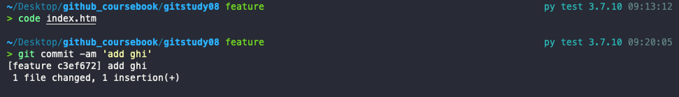

# 병합과 충돌

## 병합  
브랜치를 생성하는 목적은 원본 코드에 영향을 주지 않고 분리하여 개발하기 위해서이다. 독립 된 브랜치에서 개발 작업이 끝나면 다시 원본 브랜치에 작업한 결과를 반영해야 한다. 분리된 브랜치를 한 브랜치로 합치는 작업을 **병합(merge)**이라고 한다.  

### 깃으로 자동 병합
깃의 자동 병합은 원본을 기준으로 두 파일의 변경 이력을 비교한다. 변경된 파일 내용이 발견되면 자동으로 수정된 코드 내용을 병합한다.  

깃의 병합은 브랜치를 기준으로 한다. 브랜치는 같은 저장소 내에서 서로 독립적으로 작업을 분리한 영역이다. 분리돈 각각의 브랜치에서 수정된 사항을 하나의 브랜치로 병합한다.   병합하고자 하는 브랜치는 같은 로컬 저장소에 있어야 한다.  
그렇다고 해서 깃이 모든 코드를 완벽히 병합 처리 할 수 는 없다.이를 `충돌`이라고 한다.    

### 병합 방식

깃의 병합은 브랜치를 기반으로 실행한다.  각 브랜치를 비교하여 자동 병합하는 형태이다.  따라서 병합하려면 브랜치를 만들어 브랜치 안에서 수정 작업을 해야한다.  
병합할 때는 상대적인 기준을 판별하는 알고리즘들이 존재한다. 이 알고리즘들은 기준점과 수정 사항을 병합하는 처리 로직에 따라 다르다.  
깃은 병합을 위해 두 가지 기본적인 알고리즘 방식을 제공한다.  
- Fast-Forward 병합
- 3-way 병합  

**실습을 위한 미리 별도의 저장소 준비**  

  

## Fast-Forward 병합  

깃의 가장 간단한 브랜치 병합은 `Fast-Forward` 방식이다. 일반적으로 Fast-Forward 병합 방식은 혼자 개발할 때 사용한다.  

혼자 개발할 때는 브랜치가 생성된 커밋에 따라 순차적으로 분기된다.  
또 코드 수정도 순차적으로 할 때가 많다. 즉, 브랜치가 분기되지만 전체 커밋 그림으로 보면 모든 변경 사항은 순차적으로 진행된다. 이러한 순차적 커밋에 맞추어 병합을 처리하는 방법이 Fast-Forward 병합이다.      

### 브랜치 생성과 수정 작업  

실습을 위해 새로운 feature 브랜치를 생성하고 feature 브랜치로 체크아웃 하자.  

    

브랜치를 생성할 때 분기 기준은 master의 최종 커밋 포인터이다. 포인터를 확인할 수 있는 rev-parse 명령어로 확인해 보자.  

      

이 과정은 다음과 같이 나타낼 수 있다.   

       

생성한 feature 브랜치 안에 있는 index.htm 파일을 수정하여 커밋해보자

        
이 과정을 그림으로 나타내면 다음과 같다.  

        

위 과정을 여러번 반복 해서 그림으로 나타내면 다음과 같다.  

  

  

### 병합 위치  
깃의 merge 명령어는 브랜치를 병합한다. mmerge 명령어는 **현재 브랜치를 기준**으로 다른 브랜치의 모든 커밋을 병합한다.  

`$ git merge 브랜치이름`  
브랜치를 병합하려면 기준과 대상이 있어야 한다. 기준은 체크아웃된 현재 브랜치이다. 따라서 병합하려면 먼저 기준이 되는 브랜치로 이동해야 한다. 작업한 feature 브랜치를 다시 master 브랜치로 병합하자.    

    
이제 feature 브랜치에서 작업한 내용을 병합해 보자  
### Fast-Forward
     
feature 브랜치의 커밋을 master 브랜치에 병합했다. 병합 메시리즐 확인해보면 
Fast-forward방식을 이용해 병합되었다고 출력된다.  
      
위 그림처럼 feature 브랜치의 커밋들이 하나씩 master 브랜치로 병합한다. master 브랜치에는 커밋이 하나도 없기 때문에 feature 브랜치가 master 브랜치로 이동한 것처럼 보인다.      

log 명령어로 커밋 기록을 확인해보자 

        
Fast-Forward 병합은 작업한 브랜치를 원본 브랜치에 병합할 때 **작업한 브랜치의 시작 커밋을 원본 브랜치 이후의 커밋으로 가르킨다.** 이는 단순히 커밋 위치를 최신으로 옮기는 것과 비슷하다.    

## 3-way 병합  
3-way 병합은 좀 더 복잡한 병합을 처리할 수 있는 방법이다. 여러 개발자와 협업으로 작업하는 경우 대부분 3-way병합을 사용한다.  

### 브랜치 생성과 수정 작업  
새로운 작업을 할 hotfix 브랜치를 생성하고, hotfix 브랜치로 체크아웃 한다.  

  
파일을 수정하고 스테이지에 등록한 후 커밋하자  

    
다시 또 파일을 수정하고 한번더 커밋하자.  

  

위 과정을 그림으로 나타내면 다음과 같다.    

    

### 마스터 변경
이번에는 브랜치 모양을 변경해 보자. master 브랜치에도 새로운 커밋을 추가하자.  우선 hotfix 브랜치에서 master 브랜치로 이동하자.

      

hotfix 브랜치의 마지막 커밋은 `725e132`이고 master 브랜치의 마지막 커밋은 `2cdb94a`이다. 시간적으로 좀 더 앞단계인 master 브랜치에 새로운 커밋을 추가해 보자.    

총 2번의 수정 이후 2번의 커밋을 진행했다.  

         
master 브랜치에 추가 커밋이 발생하면 다음과 같이 브랜치는 `2cdb94a`을 기준으로 hotfix와 master 브랜치로 갈라진다.  
**기준 커밋에서 서로 다른 브랜치의 커밋이 연결된다**  

        

### 공통 조상
위 실습에서 브랜치별로 각각 커밋하면 두 브랜치로 갈라지는 모습을 보았다. 
이처럼 브랜치 모양이 갈라지는 형태로 나뉠 때는 Fast-Forward 방식의 알고리즘을 적용하여 병합할 수 없다. 이 때는 다름 병합 알고리즘인 3-way 방식을 사용해야 한다.  

두 브랜치를 병합하려면 먼저 분할 기준인 공통 커밋을 찾아야 한다. 이를 `공통 조상 커밋`이라고 한다. 공통 조상 커밋을 포함하는 브랜치와 새로운 두 브랜치, 이렇게 3개를 하나로 병합해야 한다.  **브랜치가 3개 있다고 해서 `3-way 병합`이라고 한다.**  

   

깃은 3-way 병합을 할 때 공통 조상 커밋을 자동으로 찾아 준다.   
### 병합 커밋

병합은 각 브랜치에서 독립적으로 작업된 소스를 파일 하나로 결합한다.    

3-way 병합은 두 브랜치에서 공통 조상 커밋을 자동으로 찾아 주며, 공통 조상 커밋을 기준으로 브랜치를 병합한다. 그리고 병합을 성공적으로 완료한 후에는 새로운 커밋을 추가로 하나 생성한다. 새로 생성된 커밋을 `병합 커밋`이라고 한다.  

     

이제 hotfix 브랜치를 master 브랜치에 병합해 보자. hotfix 브랜치를 병합하려면 먼저 기준이 되는 master 브랜치로 체크아웃 해야 한다.    

`$ git merge 브랜치명`  

3-way 방식으로 hotfix 브랜치와 master 브랜치를 병합하는 것을 그림으로 나타내면 다음과 같다.

       

## 브랜치 삭제 

브랜치를 병합한 후에는 병합한 브랜치를 어떻게 관리할지 결정해야 한다. 일반적으로 병합한 이후에는 병합된 브랜치를 삭제한다.  하지만 지속적인 통합과 개발을 해야 하는 브랜치라면 병합 후에도 계속 남겨 둔다.  

### 병합 후 삭제

병합된 브랜치의 커밋은 모두 원본 브랜치에 적용된다. 따라서 중복되는 커밋을 가지는 별도의 브랜치를 유지할 필욘느 없다. 불필요한 브래니는 삭제한다.  

`$ git branch -d hotfix`  

        
병합을 완료하지 않은 브랜치를 삭제하고 싶다면 대문자 `-D`옵션을 사용해야 한다.  
 

## 브랜치 병합 여부 확인

다수의 브랜치가 있을 때는 어는 브랜치가 병합을 완료한 것인지 알기 어렵다. 브랜치를 병합한 후에 바로 병합된 브래니를 삭제한다면 이러한 혼동을 줄일 수 있을 것이다.  
깃은 병합한 브랜치와 병합하지 않은 브랜치를 구분하는 옵션을 제공한다.  
`$ git branch --merged`  
master 브랜치에서 이 명령어를 실행해보자  

        
병합한 브랜드는 별표(*) 기호로 표시된다.  병합을 완료한 브랜치는 `-d` 옵션을 사용하여 삭제할 수 있다.  

병합하지 않은 브랜치는 `--no-merged`옵션으로 확인할 수 있다.  

`$ git branch --no-merged`  

병합하지 않은 브랜치는 -d 옵션으로 삭제되지 않으므로 -D 옵션을 사용한다.   

## 리베이스
브랜치를 합치는 방법은 두 가지이다.  
앞에서 배운 병합(merge)과 이 절에서 학습할 리베이스(rebase)이다.   

리베이스는 커밋의 트리 구조를 재배열 한다. 커밋을 재배열하는 변경결과가 병합과 유사하다. 사실 실무에서는 merge 명령어보다는 커밋을 재배열 하는 리베이스를 더 선호한다.  

### 베이스   
모든 브랜치는 뿌리가 있다.(master 브랜치 제외) 브랜치는 특정 커밋을 가리키는 포인터이다. 그리고 가리키는 특정 커밋은 브랜치가 파생된 기준이 된다. 즉, 브랜치는 커밋 하나를 기준으로 새로운 작업을 진행할 수 있는  분리된 작업 경로를 의미한다.   

     
그림에서 새로운 브랜치가 커밋2에서 파생된다. 새로운 **브랜치가 파생되는 커밋2를 베이스(base)**라고 한다.  

### 베이스 변경
리베이스는 파생된 브랜치의 기준이 되는 베이스 커밋을 변경하는 것이다.  그렇다면 브랜치의 베이스는 왜 