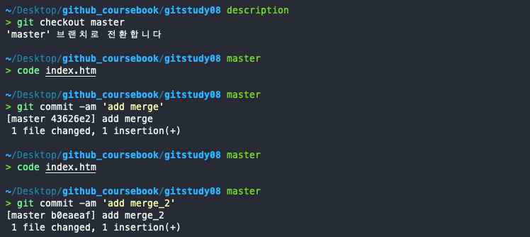

# 병합과 충돌

## 병합  
브랜치를 생성하는 목적은 원본 코드에 영향을 주지 않고 분리하여 개발하기 위해서이다. 독립 된 브랜치에서 개발 작업이 끝나면 다시 원본 브랜치에 작업한 결과를 반영해야 한다. 분리된 브랜치를 한 브랜치로 합치는 작업을 **병합(merge)**이라고 한다.  

### 깃으로 자동 병합
깃의 자동 병합은 원본을 기준으로 두 파일의 변경 이력을 비교한다. 변경된 파일 내용이 발견되면 자동으로 수정된 코드 내용을 병합한다.  

깃의 병합은 브랜치를 기준으로 한다. 브랜치는 같은 저장소 내에서 서로 독립적으로 작업을 분리한 영역이다. 분리돈 각각의 브랜치에서 수정된 사항을 하나의 브랜치로 병합한다.   병합하고자 하는 브랜치는 같은 로컬 저장소에 있어야 한다.  
그렇다고 해서 깃이 모든 코드를 완벽히 병합 처리 할 수 는 없다.이를 `충돌`이라고 한다.    

### 병합 방식

깃의 병합은 브랜치를 기반으로 실행한다.  각 브랜치를 비교하여 자동 병합하는 형태이다.  따라서 병합하려면 브랜치를 만들어 브랜치 안에서 수정 작업을 해야한다.  
병합할 때는 상대적인 기준을 판별하는 알고리즘들이 존재한다. 이 알고리즘들은 기준점과 수정 사항을 병합하는 처리 로직에 따라 다르다.  
깃은 병합을 위해 두 가지 기본적인 알고리즘 방식을 제공한다.  
- Fast-Forward 병합
- 3-way 병합  

**실습을 위한 미리 별도의 저장소 준비**  

  

## Fast-Forward 병합  

깃의 가장 간단한 브랜치 병합은 `Fast-Forward` 방식이다. 일반적으로 Fast-Forward 병합 방식은 혼자 개발할 때 사용한다.  

혼자 개발할 때는 브랜치가 생성된 커밋에 따라 순차적으로 분기된다.  
또 코드 수정도 순차적으로 할 때가 많다. 즉, 브랜치가 분기되지만 전체 커밋 그림으로 보면 모든 변경 사항은 순차적으로 진행된다. 이러한 순차적 커밋에 맞추어 병합을 처리하는 방법이 Fast-Forward 병합이다.      

### 브랜치 생성과 수정 작업  

실습을 위해 새로운 feature 브랜치를 생성하고 feature 브랜치로 체크아웃 하자.  

    

브랜치를 생성할 때 분기 기준은 master의 최종 커밋 포인터이다. 포인터를 확인할 수 있는 rev-parse 명령어로 확인해 보자.  

      

이 과정은 다음과 같이 나타낼 수 있다.   

       

생성한 feature 브랜치 안에 있는 index.htm 파일을 수정하여 커밋해보자

        
이 과정을 그림으로 나타내면 다음과 같다.  

        

위 과정을 여러번 반복 해서 그림으로 나타내면 다음과 같다.  

  

  

### 병합 위치  
깃의 merge 명령어는 브랜치를 병합한다. mmerge 명령어는 **현재 브랜치를 기준**으로 다른 브랜치의 모든 커밋을 병합한다.  

`$ git merge 브랜치이름`  
브랜치를 병합하려면 기준과 대상이 있어야 한다. 기준은 체크아웃된 현재 브랜치이다. 따라서 병합하려면 먼저 기준이 되는 브랜치로 이동해야 한다. 작업한 feature 브랜치를 다시 master 브랜치로 병합하자.    

    
이제 feature 브랜치에서 작업한 내용을 병합해 보자  
### Fast-Forward
     
feature 브랜치의 커밋을 master 브랜치에 병합했다. 병합 메시리즐 확인해보면 
Fast-forward방식을 이용해 병합되었다고 출력된다.  
      
위 그림처럼 feature 브랜치의 커밋들이 하나씩 master 브랜치로 병합한다. master 브랜치에는 커밋이 하나도 없기 때문에 feature 브랜치가 master 브랜치로 이동한 것처럼 보인다.      

log 명령어로 커밋 기록을 확인해보자 

        
Fast-Forward 병합은 작업한 브랜치를 원본 브랜치에 병합할 때 **작업한 브랜치의 시작 커밋을 원본 브랜치 이후의 커밋으로 가르킨다.** 이는 단순히 커밋 위치를 최신으로 옮기는 것과 비슷하다.    

## 3-way 병합  
3-way 병합은 좀 더 복잡한 병합을 처리할 수 있는 방법이다. 여러 개발자와 협업으로 작업하는 경우 대부분 3-way병합을 사용한다.  

### 브랜치 생성과 수정 작업  
새로운 작업을 할 hotfix 브랜치를 생성하고, hotfix 브랜치로 체크아웃 한다.  

  
파일을 수정하고 스테이지에 등록한 후 커밋하자  

    
다시 또 파일을 수정하고 한번더 커밋하자.  

  

위 과정을 그림으로 나타내면 다음과 같다.    

    

### 마스터 변경
이번에는 브랜치 모양을 변경해 보자. master 브랜치에도 새로운 커밋을 추가하자.  우선 hotfix 브랜치에서 master 브랜치로 이동하자.

      

hotfix 브랜치의 마지막 커밋은 `725e132`이고 master 브랜치의 마지막 커밋은 `2cdb94a`이다. 시간적으로 좀 더 앞단계인 master 브랜치에 새로운 커밋을 추가해 보자.    

총 2번의 수정 이후 2번의 커밋을 진행했다.  

         
master 브랜치에 추가 커밋이 발생하면 다음과 같이 브랜치는 `2cdb94a`을 기준으로 hotfix와 master 브랜치로 갈라진다.  
**기준 커밋에서 서로 다른 브랜치의 커밋이 연결된다**  

        

### 공통 조상
위 실습에서 브랜치별로 각각 커밋하면 두 브랜치로 갈라지는 모습을 보았다. 
이처럼 브랜치 모양이 갈라지는 형태로 나뉠 때는 Fast-Forward 방식의 알고리즘을 적용하여 병합할 수 없다. 이 때는 다름 병합 알고리즘인 3-way 방식을 사용해야 한다.  

두 브랜치를 병합하려면 먼저 분할 기준인 공통 커밋을 찾아야 한다. 이를 `공통 조상 커밋`이라고 한다. 공통 조상 커밋을 포함하는 브랜치와 새로운 두 브랜치, 이렇게 3개를 하나로 병합해야 한다.  **브랜치가 3개 있다고 해서 `3-way 병합`이라고 한다.**  

   

깃은 3-way 병합을 할 때 공통 조상 커밋을 자동으로 찾아 준다.   
### 병합 커밋

병합은 각 브랜치에서 독립적으로 작업된 소스를 파일 하나로 결합한다.    

3-way 병합은 두 브랜치에서 공통 조상 커밋을 자동으로 찾아 주며, 공통 조상 커밋을 기준으로 브랜치를 병합한다. 그리고 병합을 성공적으로 완료한 후에는 새로운 커밋을 추가로 하나 생성한다. 새로 생성된 커밋을 `병합 커밋`이라고 한다.  

     

이제 hotfix 브랜치를 master 브랜치에 병합해 보자. hotfix 브랜치를 병합하려면 먼저 기준이 되는 master 브랜치로 체크아웃 해야 한다.    

`$ git merge 브랜치명`  

3-way 방식으로 hotfix 브랜치와 master 브랜치를 병합하는 것을 그림으로 나타내면 다음과 같다.

       

## 브랜치 삭제 

브랜치를 병합한 후에는 병합한 브랜치를 어떻게 관리할지 결정해야 한다. 일반적으로 병합한 이후에는 병합된 브랜치를 삭제한다.  하지만 지속적인 통합과 개발을 해야 하는 브랜치라면 병합 후에도 계속 남겨 둔다.  

### 병합 후 삭제

병합된 브랜치의 커밋은 모두 원본 브랜치에 적용된다. 따라서 중복되는 커밋을 가지는 별도의 브랜치를 유지할 필욘느 없다. 불필요한 브래니는 삭제한다.  

`$ git branch -d hotfix`  

        
병합을 완료하지 않은 브랜치를 삭제하고 싶다면 대문자 `-D`옵션을 사용해야 한다.  
 

## 브랜치 병합 여부 확인

다수의 브랜치가 있을 때는 어는 브랜치가 병합을 완료한 것인지 알기 어렵다. 브랜치를 병합한 후에 바로 병합된 브래니를 삭제한다면 이러한 혼동을 줄일 수 있을 것이다.  
깃은 병합한 브랜치와 병합하지 않은 브랜치를 구분하는 옵션을 제공한다.  
`$ git branch --merged`  
master 브랜치에서 이 명령어를 실행해보자  

        
병합한 브랜드는 별표(*) 기호로 표시된다.  병합을 완료한 브랜치는 `-d` 옵션을 사용하여 삭제할 수 있다.  

병합하지 않은 브랜치는 `--no-merged`옵션으로 확인할 수 있다.  

`$ git branch --no-merged`  

병합하지 않은 브랜치는 -d 옵션으로 삭제되지 않으므로 -D 옵션을 사용한다.   

## 리베이스
브랜치를 합치는 방법은 두 가지이다.  
앞에서 배운 병합(merge)과 이 절에서 학습할 리베이스(rebase)이다.   

리베이스는 커밋의 트리 구조를 재배열 한다. 커밋을 재배열하는 변경결과가 병합과 유사하다. 사실 실무에서는 merge 명령어보다는 커밋을 재배열 하는 리베이스를 더 선호한다.  

### 베이스   
모든 브랜치는 뿌리가 있다.(master 브랜치 제외) 브랜치는 특정 커밋을 가리키는 포인터이다. 그리고 가리키는 특정 커밋은 브랜치가 파생된 기준이 된다. 즉, 브랜치는 커밋 하나를 기준으로 새로운 작업을 진행할 수 있는  분리된 작업 경로를 의미한다.   

     
그림에서 새로운 브랜치가 커밋2에서 파생된다. 새로운 **브랜치가 파생되는 커밋2를 베이스(base)**라고 한다.  

### 베이스 변경
리베이스는 파생된 브랜치의 기준이 되는 베이스 커밋을 변경하는 것이다.  브랜치의 베이스를 변경하는 이유는 커밋의 진행 모습을 단순화 하기 위해서 이다.   
브랜치가 많아지면 커밋을 관리하고 파악하기 어렵다. 
  
리베이스는 코드의 베이스 분기점을 변경하여 마치 하나의 기찻길처럼 만든다. 여러 갈래로 갈라지지 않아 커밋의 진행 사항을 좀 더 쉽게 파악할 수 있다.      

       

그림처럼 리베이스는 브랜치 A의 공통된 조상인 커밋2를 master 브랜치의 마지막 커밋6로 변경한다. 그리고 모든 브랜치의 커밋들을 리베이스된 커밋6 이후로 재정렬 한다.
### 리베이스 vs 병합

병합은 파생된 두 브랜치를 하나로 합치는 과정이다. 병합하려면 두 브랜치의 공통 조상 커밋을 먼저 찾아야 한다. 공통 조상 커밋을 찾으면 서로 다르게 커밋이 진행된 두 브랜치를 3-way 방식으로 병합할 수 있다.  
공통 조상 커밋은 두 브랜치를 병합하는 베이스 커밋이다. 병합하는 두 브랜치는 순차적으로 커밋을 비교하면서 마지막 최종 커밋을 생성한다.  

  

반면에 **리베이스는 두 브랜치를 서로 비교하지 않고 순차적으로 커밋 병합**을 시도한다.   

리베이스를 하면 먼저 공통 조상 커밋을 찾는다. 리베이스는 베이스 커밋을 변경하여 두 브랜치의 커밋 위치를 바꾼다. 그리고 파생된 브랜치의 diff를 임시 공간에 잠시 보관한다.  master브랜치의 커밋1 -> 커밋2 -> 커밋5 -> 커밋6까지 진행한다. 기존 베이스 커밋2에서 커밋6로 베이스 기준점을 변경한다. 변경하는 기준 브랜치의 마지막 커밋에서 차례로 임시 공간에 저장한 diff를 하나씩 적용한다. 새로운 베이스 기준점을 기반으로 한 브랜치에서 커밋3 -> 커밋4를 커밋6에서 연장하여 수정 재배치 한다.  

   

결과적으로 브랜치의 커밋4는 최종 코드로 모든 코드 내용이 반영되어 있다. 커밋4 입장에서는 두 브랜치를 병합한 결과물이다.  
리베이스 결과물을 보면 기존 병합과 두 가지 차이점이 있다. 첫째, 3-way 병합은 병합 커밋이 있지만, 리에비이스를 하면 병합 커밋은 없다. 둘째, 브랜치의 마지막을 가리키는 커밋 위치가 다르다. 브랜치 A는 커밋4를 가리키지만, master 브랜치는 아직 커밋6를 가리킨다.  

### 리베이스 명령어 

리베이스 작업은 rebase 명령어를 사용한다. 또는 다른 명령어의 옵션으로 리베이스 기능을 수행할 수 있다.  

`$ git rebase 브랜치`   

**rebase 실습**   

description 브랜치를 만들고 index.htm 파일을 수정해 커밋한다. 

  
다시 master 브랜치로 체크아웃한다. master 브랜치에서도 index.htm을 수정한 후 두 번 커밋한다.  

    
베이스 커밋 하나를 기준으로 서로 다른 브랜치에 각각의 커밋이 추가되엇다.    

보통 브랜치별로 각각 커밋이 진행된 경우에는 3-way 병합을 한다. 하지만 이번에는 리베이스를 이용해 두 브랜치를 병합해 보자.  

### 리베이스 병합  

리베이스는 병합 기준 브랜치가 merge 명령어와 반대이다. merge 명령어를 사용한 병합은 현재의 기준 브랜치에서 다른 브랜치를 읽어 와서 결합한다.  

  
하지만 **리베이스는 병합되는 브랜치 방향이 반대**이다.    

    

지금까지 실습과정을 그림으로 나타내면 다음과 같다.  

    
리베이스를 할 수 있게 description 브랜치로 체크아웃하고 description 브랜치에서 원본 master 브랜치를 리베이스하자.    

    

리베이스명령이 실행되면 파ㅇ생 브랜치의 **커밋들은 기준 브랜치의 마지막 커밋으로 재정렬**된다.  

### 리베이스 되었는지 확인  

리베이스는 베이스 커밋을 변경하여 병합한다고 했다. 베이스 커밋을 변경하는 과정에서 커밋들은 재배치 작업을 한다.  
 이 과정에서 **커밋의 해시 값이 변경**된다.  
 리베이스 한 후 로그를 확인해 보자.  

       

 로그를 확인하니 리베이스 병합 이후에 커밋 ID가 변경되었다.  

       

 리베이스는 커밋 위치를 변경한다. 따라서 커밋 위치가 변경돌 때 해시 값 중복을 방지하려고 새로운 커밋 해시를 생성한다.    

 ### 리베이스 후 브랜치 
 리베이스 이후 커밋은 정리되었지만, master와 description 브랜치의 위치는 서로 다르다.    
         
 **리베이스는 커밋 위치를 재조정할 뿐 브랜치의 HEAD 포인터까지 옮겨 주지는 않는다.**  리베이스한 후에는 이러한 병합 브랜치의 HEAD를 맞춰야한다. 즉, 리베이스된 브랜치를 병합해야 한다.  

 병합을 위해 master 브랜치로 체크아웃하고 master 브랜치에서 merge 명령어를 실행한다.  

          
 리베이스한 후에 실행한 병합 메시지를 살펴보면, Fast-Forward 방식으로 병합했다는 것을 알 수 있다.   

 리베이스는 커밋을 재배치만 할 뿐 실제 병합과 같은 최종 상태는 가지지 않는다. 즉, 리에비스한 후에도 HEAD 포인터를 일치하기 위해 Fast-Forward 병합을 실행해 주어야한다.  
 두 브랜치의 HEAD를 일치시키는 작업까지 해야 최종 병합을 완성할 수 있다.    

 ### 리베이스 충돌과 해결
리베이스는 기준점을 변경한다. 리베이스 역시 병합 과정에서 충돌이 발생할 수 있다. 리베이스 충동 또한 사용자가 직접 수동으로 해결해야 한다.    

간단히 충돌 환경을 만들어보자  
           
이제 리베이스를 통해 병합을 진행해보면 아래와 같이 에러가 발생하는 것을 알 수 있다.  
           

충돌이 발생하면 문제를 직접 해결해야 한다.    

리베이스는 커밋을 하나씩 따라가면서 위치를 재조정한다. **충돌을 수정한 후에는 rebase 명령어와 --continue 옵션을 사용한다.**  
`$ git rebase --continue`  
수정한 파일을 다시 스테이지 상태로 변경한다. 
리베이스를 이용하여 병합을 진행할 때는 **충돌된 부분들을 한 단계씩 해결해 나가면서 병합**할 수 있다. --continue 옵션을 사용하여 병합을 더 진행한다.  

           

### reabase 명령어로 커밋 수정
마지막 커밋은 --amend 옵션으로 수정할 수 있다. 이 방법 외에 rebase 명령어로도 최종 커밋을 수정할 수 있다.  
실제 병합은 아니지만 리베이스는 커밋 위치를 재조정하여 병합과 유사한 효과를 보인다. 그리고 Fast-Forward 병합을 이용하여 선형 구조 형태로 브랜치 모양을 정리한다. 리베이스는 커밋을 재조정하는 것 외에도 **여러 커밋을 한 커밋으로 묶을 수 있다.** 이때는 `-i 옵션`을 사용한다.  

만약 세번 커밋해서 리베이스 한 것을 하나의 커밋으로 묶고 싶다면 아래와 같이 실행시키면 된다 . 

`$ git rebase -i HEAD~3`    

           

이처럼 리베이스는 여러 커밋을 커밋 하나로 합칠 수 있다. 이때 합친 커밋에는 새 해시 값이 부여된다.   

### 리베이스할 때 주의할 점
리베이스는 커밋 위치와 해시 값을 변경한다. **저장소를 외부에 공개했다면 공개된 순간부터 커밋은 리베이스를 사용하지 않는 것이 원칙**이다.  

리베이스는 외부로 코드를 푸시하거나 공개하기 전에 로컬에서만 실행하는 것이 좋다. 외부에 공개된 커밋을 리베이스하면 커밋 위치와 해시 값이 변경되어 너무 혼란스럽다. 공개된 커밋을 변경할 때는 `revert 명령어`를 사용하자.  

## 정리  

다수의 개발자와 협업할 때 병합과 충돌은 매우 자주 발생한다. 충돌을 해결하고 병합을 처리하는 것은 쉬운 작업이 안디ㅏ. 개발 과정에서 병합 충돌을 최소화하고 예방하려면, master 브랜치 내용을 자주 반영하여 병합하는 것이 좋다.  

원격 저장소의 master 브랜치를 모니터링하고, 변화된 부분을 즉시 반영하면서 작업하면 충돌을 최소화하거나 예방할 수 있다.  