# 복귀
## 되돌리기  
깃을 이용하여 버전을 관리하는 목적은 만일의 사태를 대비하기 위해서이다. 깃을 사용하면 언제든지 원하는 시점으로 전체 코드를 되돌릴 수 있다.  

### 다시 시작  
깃은 기록된 커밋을 기준으로 이전 상태로 되돌릴 수 있다. 즉, 코드를 항상 안정적으로 유지하고 관리할 수 있게 해 주는 도구이다.   
깃에서 코드 작업을 되돌리는 방법은 크게 `reset`꽈 `revert` 두가지 이다.     

## 리셋 
리셋은 커밋을 기준으로 이전 코드로 되돌리는 방법으로, 기록한 커밋을 취소합니다. 커밋을 취소하는 만큼 리셋할 때는 항상 신중하게 작업해야한다.  

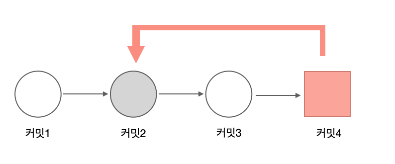  

### 복귀 시점

복귀는 어떤 시점으로 돌아가는 것을 의미한다. 따라서 이전 코드로 복귀하려면 복귀 시점을 알려 주어야 한다. 리셋은 이 시점을 커밋을 기준으로 정한다. 커밋은 log 명령어로 조회할 수 있다. log 명령어를 실행하면 커밋의 해시 값과 메시지를 출력한다. 따라서 복귀 하고자 하는 특정 시점을 찾는데 매우 유용하다. 우선 현재 커밋을 확인해 보자. 
로그 기록을 확인할 때 `--oneline` 옵션을 같이 사용하면 간략한 커밋 해시 값과 메시지를 같이 출력한다. 

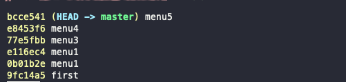  
로그 기록을 그림으로 표현하면 다음과 같다.    

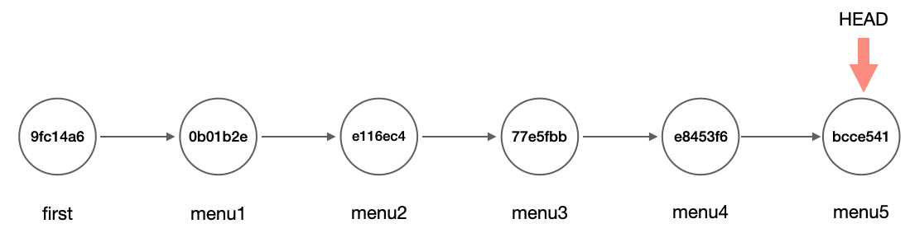    

커밋 메시지는 특정 시점을 파악하는 데 매우 좋다. 커밋 메시지는 열 ㅓ줄로 작성할 수 있으며, 로그 기록은 그중 첫 번째 줄 메시지만 출력한다. 그래서 커밋 메시지를 작성할 때는 첫 번째 줄에 요약 정보를 입력한다. 한 줄을 띄우고 좀 더 상세한 내용을 작성하면 좋다.   

고정된 커밋 해시 값을 사용하지 않고, HEAD 포인터를 이용하여 상대적 위치를 지정할 수도 있다. 다음과 같이 `캐럿(^)`, `물결(~)` 기호를 사용하여 HEAD의 상대 커밋 위치를 지정한다.  

`$ git reset --hard HEAD^^^`  

### reset 명령어   
**reset 명령어를 사용하면 지정된 커밋 코드로 되돌아간다.** 즉, 특정 커밋의 해시 값 상태로 모든 코드를 복구한다.  

`$ git reset 옵션 커밋ID`  
reset 명령어는 옵션을 함께 사용해야 하며, 세 가지 옵션이 있다. 
- soft : 스테이지 영역을 포함한 상태로 복원
- mixed : 기본 옵션 값, reset 명령어를 사용할 때 옵션을 지정하지 않으면 기본값인 mixed로 선택됨. 
- hard : 실제 파일이 삭제된 이전 상태로 복원한다.  
soft 옵션과 mixed 옵션 차이는 크게 스테이지 영역과 관련이 있다. hard 옵션은 워킹 디렉터리와 관련이 있다. 각 옵션의 차이점과 동작에 대해 알아보자.   

### soft 옵션  

soft 옵션은 가장 낮은 단계의 리셋  동작이다. 먼저 soft 옵션의 동작은 reset --soft 명령어로 이해해보자. 코드에서 HEAD~는 이전 커밋을 의미한다.  

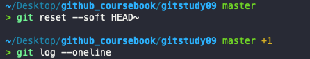    
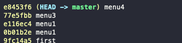    
마지막 commit이 없어진 것을 알 수 있다.   그러나 커밋 없어진다고해서 파일이 바로 수정되지는 않는다.   
**soft 옵션은 파일을 수정하고, add 명령어로 스테이지 영역에 올려 커밋을 실행하기 직전의 단계로 되돌린다.**   
그렇기 때문레 reset --soft 명령어는 마지막 커밋을 수정할 때 활용할 수 있다.  마치 --amend 명령어와 유사하다.  

`$ git commit --amend`  
### mixed 옵션 

reset 명령어의 기본값은 mixed 옵션이다.  
`$ git reset --mixde 커밋ID`  
또는 다음과 같이 mixed 옵션 생략 가능.  

`$ git reset 커밋ID`  

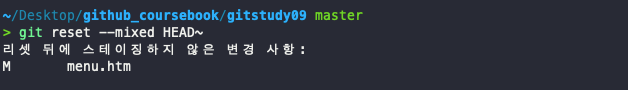   

이번에는 리셋 메시지가 같이 표시되어있다. 메시지 내용은 unstaged 상태로 변경되었다는 의미이다.    
mixed  옵션은 soft 옵션과 달리 **리셋 한 후 스테이지 상태까지 복원하지 않는다.** 따라서 커밋하려면 `add 명령어`를 먼저 실행해야 한다.  

### hard 옵션
hard는 가장 강력한 옵션이다. soft 옵션과 mixed 옵션은 이전 커밋으로 되돌리는 과정에서 실제로 삭제되는 내용은 없다. 모든 작업 내용이 워킹 디렉터리에 그대로 유지된다.   
정확히 말하면 이전 상태로 되돌아가는 것이 아니다. 복귀 커밋 이후의 작업들은 워킹 디렉터리 영역에 남겨 두어 다시 수정하거나 커밋할 수 있도록 상태만 변경하는 것이다.  
이에 반해 hard 옵션은 리셋되는 복귀 시점의 커밋 상태와 해당 커밋의 워킹 디렉터리까지 모두 되돌린다.  즉, `reset --hard명령어`를 사용한 커밋 이후의 모든 내용은 삭제된다.   
따라서 hard 옵션은 주의해서 사용해야 한다.  

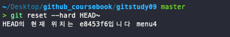   
hard 옵션을 실행하면 리셋된 결과 메시지가 출력된다. 그리고 삭제 이후의 마지막 HEAD 커밋의 해시 값이 출력된다.  

soft 옵션 리셋과 달리 **커밋하지 않은 변경사항""이 없다. 그리고 menu4로 HEAD의 포인터가 변경되었다.  

또한 파일도 변경된다. soft나 mixed 옵션과 달리 이전에 커밋한 시점에서 작성한 파일 내용으로 변경되었다. 이처럼 실제 파일 내용이 변경되는 것은 **hard 옵션을 사용하면 워킹디렉터리 내용도 함꼐 삭제**되기 때문이다.  

### 커밋 합치기
앞에서 리베이스 병햡의 -i 옵션을 사용하면 여러 커밋을 하나로 합치는 동작을 수행할 수 있었다. 또 단일 커밋 명령어의 --amend 옵션으로 커밋을 수정할 수 있었다.   
리셋의 동작 원리를 이해하고 있다면 커밋도 수정할 수 있다.   
리셋의 soft 옵션은 HEAD를 해당 커밋으로 이동한다. 그리고 원본 내용은 그대로 워킹 디렉터리에 남겨 둔다.  
**menu3과 menu4 커밋을 reset 명령어를 사용하여 하나로 합쳐보자**  

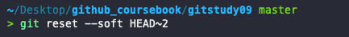  
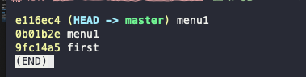  

지금까지 작업한 상태를 그림으로 표현하면 다음과 같다.    

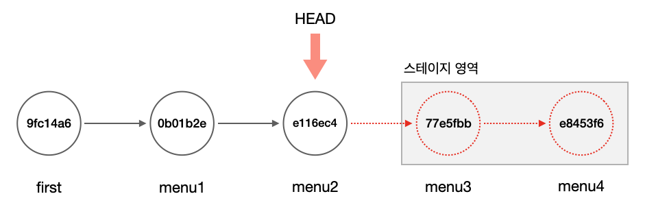  

이제 커밋을 합쳐 다시 메시지를 작성한다.  

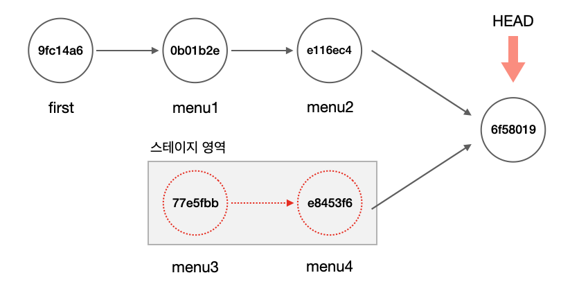  

menu3과 menu4는 커밋 2개를 합쳐 커밋 하나를 만든 것과 같다.  

### 작업 취소
코드를 수정하는 도중 오류가 생겨 현재 작업을 모두 취소하고 싶을 수 있다. 보통은 다음과 같이 워킹 디렉터리에서 코드를 수정하고, 수정한 코드는 다시 스테이지 영역에 등록한다. 

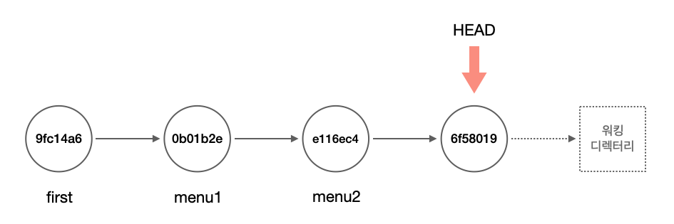  
수정 작업을 완전히 취소하려면 **워킹 디렉터리와 스테이지 상태를 모두 제거하여 마지막 커밋 상태로 되돌려 놓아야한다.** 그림을 보면 HEAD 포인턴느 가장 마지막의 커밋 위치를 가리킨다. 그리고 수정 작업들을 모두 워킹 디렉터리 안에 남아 있다. 리셋할 때의 **시점을 현재 HEAD**를 기준으로 하면 해당 시점의 수정 작업을 모두 삭제할 수 있다.  

`$ git reset --hard HEAD`  

### 병합 취소  
리셋은 병합된 브랜치도 취소할 수 있다. 다음과 같이 브랜치를 만들어 보자. 
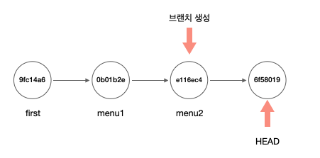  

menu2 커밋 해시키를 직접 지정하여 menu 브랜치를 생성해보고, menu 브랜치로 체크아웃해보자.  

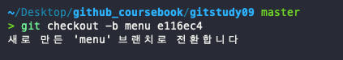  

만든 브랜치에서 menu.htm 파일을 수정하고 저장한 후 커밋하자.  

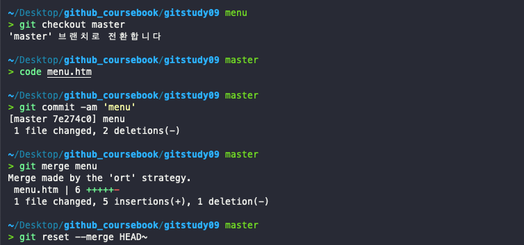    

1. `index.htm` 데이터를 수정하고, commit 
2. master 브랜치와 menu 브랜치를 merge 
3. git reset --merge HEAD~ 명령어를 통해 merge 내역 삭제
## 리버트 

공개된 커밋은 보통 리셋 작업을 하지 않는다. 그렇다면 공개한 저장소에서는 이전 상태로 되돌리려면 어떻게 해야할까? 깃은 커밋의 버전을 되돌릴 수 있는 또 다른 방법이 리버트를 제공한다.  

### 취소 커밋 

리셋은 기존 커밋 정보를 삭제하는 반면, **리버트는 기존 커밋을 남겨 두고 취소에 대한 새로운 커밋을 생성**한다.  취소 커밋을 생성할 때는 revert 명령어를 사용한다. 취소 커밋은 지정한 커밋을 삭제하지 않는다. 그 대신 삭제를 위한 새로운 커밋을 생성한다.    

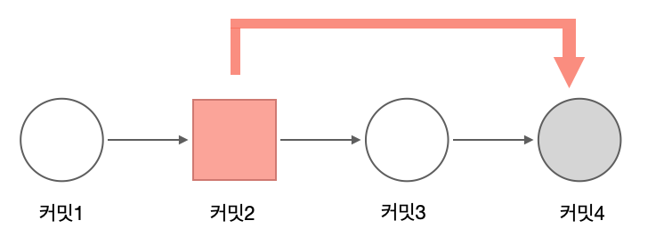     

리버트를 실습하기위해 menu5~menu7까지 추가하고 커밋해보자.  

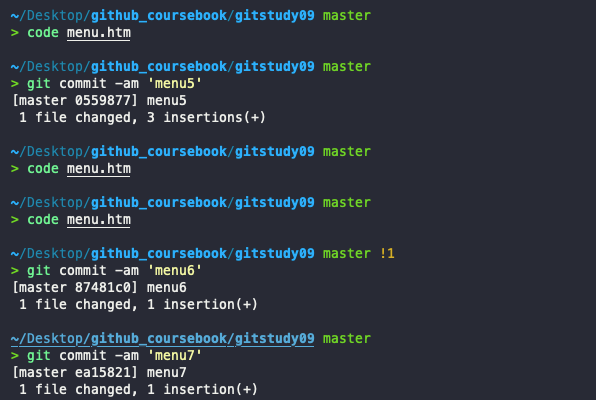     

직전의 커밋을 리버트할 때는 HEAD 포인터를 사용하면 편리하다. 리셋으로 커밋을 삭제하지 않고 리버트로 취소 커밋을 생성해보자.  

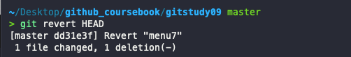

성공적으로 리버트가 되었고 이제 menu.htm 파일을 확인해 보자.  

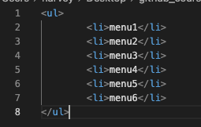  

menu.htm을 살펴보면 mane7 태그가 삭제 된 것을 알수있다.  또한 커밋 로그를 살펴보면 `Revert menu7`이 생성된 것을 알 수 있다.

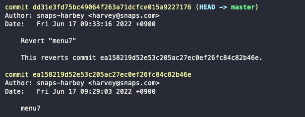    

### 리버트 지정  
직전의 커밋은 간단하게 HEAD 포인터를 이용하여 리버트했다. 한 번에 여러 커밋을 리버트해야 한다면 어떻게 해야할까?  
**리버트는 한 번에 커밋 하나만 취소할 수 있다.** 따라서 여러 커밋을 리버트하려면 최신 커밋부터 순차적으로 취소해야 한다.    

그리고 직전의 커밋이 아닌 다른 커밋을 취소할 때는 커밋 해시 값을 지정하면 된다.
`$ git revert 커밋ID`    

깃의 범위 지정 연산자를 사용하여 여러 커밋을 리버트할 수도 있다. `연산자 ..`를 같이 사용한다.  

`$ git revert 커밋ID .. 커밋ID`  

### 병합 취소  

리버트를 이용하여 병합한 커밋을 취소할 수 있다. 리셋은 방금 전 실행한 병합만 삭제한다. 하지만 리버트는 시간이 지난 후에도 과거의 병합을 선택하여 삭제할 수 있다.  

리버트로 병합을 췩소할 때는 `--mainline` 옵션을 같이 사용할 수 있다.  

`$ git revert --mainline 숫자 병합커밋ID`  

--mainline옵션은 병합을 취소한 후 체크아웃되는 브랜치를 표시한다. 

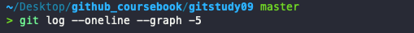    
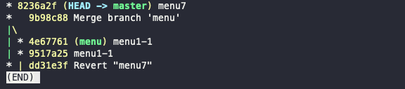     

출력 결과에서 `9b98c88`이 merge시점의 커밋 ID이다. 이 시점으로 리버트해보자.  

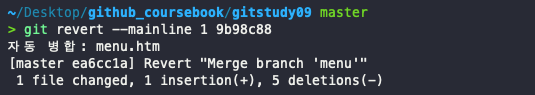     

이제 기존 병합이 리버트 되었다.

### 리버트 히스토리
리버트를 실행하면 새 커밋이 추가되기 때문에 커밋 이력이 복잡하다. 어떻게 보면 리셋으로 간단하게 이전 상태로 되돌리는 것이 간편해 보일 수도있다. 하지만 저장소를 공개했다면 리셋으로 커밋을 삭제하는 것은 협업 차원에서 위험하다.  

## 정리
리셋과 리버트는 버전 관리의 특성을 그대로 보여주는 기능이다. 리셋과 리버트는 동작을 취소하고 과거로 돌아간다는 면에서는 유사하다. 코드 변경 이력을 저장하고 필요한 시점헤 해당 코드 상태로 쉽게 이동할 수 있다.   

