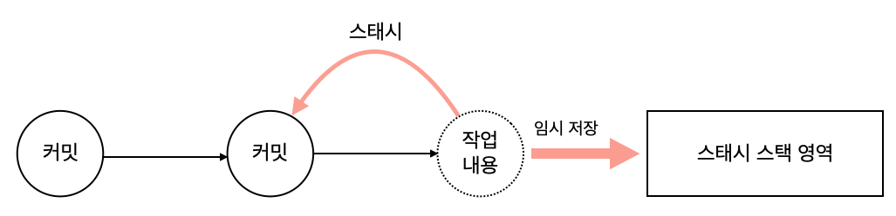

# 임시처리
## 스태시  
작업 브랜치를 변경하려면 워킹디렉터리는 깨끗한(clean)상태로 정리되어 있어야 한다.   
워킹 디렉터리에 작업 중인 내용이나 커밋되지 않은 변경 사항들이 남아 있으면 브랜치를 변경할 수 없다.  
예를 들어 브랜치에서 코드를 수정하는 도중에 새로운 버그가 발견되거나, 고객의 요청으로 코드를 추가하는 경우가 발생할 수 있다.  
하지만 현재 작업 중인 코드 역시 수정이 끝난 사항이 아닐때 `스태시`를 활용 할 수 있다. 스태시는 간단히 말해 `안전한 보관`이다.  

  

스태시는 **현재 워킹 디렉터리 내역을 별도 스택 영역에 잠시 보관하라**라는 명령이다.   
스태시는 브랜치를 이동할 때 작업 중인 내용 때문에 워킹 디렉터리가 충돌하는 것을 방지하는 데 사용한다.  

   

스태시 명령을 실행하면 현재 작업 중인 내용은 임시 저장되고, 수정 전 마지막 커밋 상태로 돌아간다. 즉, 이전 커밋 후 작업하지 않은 상태의 워킹 디렉터리가 된다.  

스태시를 하려먼 `stash 명령어`를 실행한다. 기본 명령어로 스태시를 실행하거나 옵션을 사용하여 추가 기능을 선택할 수 있다.   
스태시는 로컬 저장소에서만 사용 가능하다.    

  

스태시 실습을 위해 새로운 폴더를 만들고 stash.htm 파일을 생성합니다.  

### 기존 작업 도중에 새로운 변경 요청

코드 수정 작업을 하는 도중에 또 다른 수정 요청이 있는경우에, 현재 작업은 잠시 멈추고  또 다른 요청을 반영하려면 새로운 브랜치가 필요하다. 