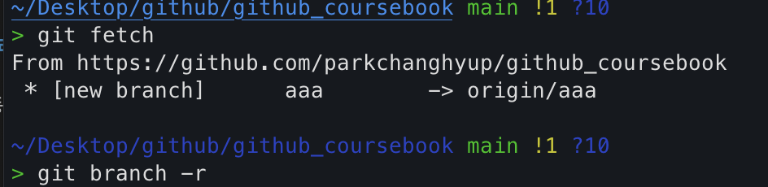

# 브랜치
브랜치는 **나뭇가지, 지사, 분점**등 줄기 하나에서 뻗어 나온 갈림길을 의미한다.  
큰 나무 줄기에서 작은 줄기가 뻗어 나오는 것처럼 저장 공간 하나에서 가상의 또 다른 저장 공간을 만드는 것이라고 생각하면 된다.  

## 브랜치 작업
보통 새로운 기능을 추가하거나 많은 변경이 예상될 때 작업 폴더를 통째로 복사하고, 복사한 폴더 이름을 변경했었다. 안정적인 기존 코드는 남겨 두고, 복제된 작업 폴더에서 도전적인 작업들을 하기 위해 코드를 분리한다.  

 
커밋은 파일의 수정 이력을 관리하는데 사용한다면, 브랜치는 프로젝트를 독립적으로 관리하는데 사용한다.  
  
잦은 버그 수정과 새로운 기능을 구현할 때마다 작업 폴더를 복사하는 것은 프로젝트를 유지 관리하는 측면에서 좋지 않다. 많은 프로젝트 폴더를 복제하면 향후 코드를 통합하기 어렵다.  

 
깃을 사용하면 프로젝트 작업 폴더를 복사하지 않고 기존 코드와 분리해서 작업할 수 있다.  

## 깃 브랜치 특징 
깃 브랜치는 기존 폴더를 복제하는 것과 다르게 가상 폴더를 사용하여 개발 작업을 구분한다.  
브랜치는 다음 특징들이 있다.  

### 가상 폴더
깃의 브랜치는 작업 폴더를 실제로 복사히자 않고, **가상 폴더**로 생성한다. 외부적으로는 물리적인 파일 하나만 있는 것으로 보인다.  

생성된 작업 폴더는 물리적으로 복제된 구조보다 유연하게 처리할 수 있다. 브랜치로 생성된 가상 폴더는 빠르게 공간 이동이 가능하다. 개발자는 쉽게 가상 폴더인 브랜치를 이동하면서 프로젝트를 수행할 수 있다.  

### 독립적인 동작
브랜치를 이용하면 원본 폴더와 분리하여 독립적으로 개발 작업을 수행할 수 있다. 기존에는 소스 코드의 작업 폴더를 별도로 생성했다. 물리적으로 복사된 각자의 폴더에서 코드를 작업한 후 소스 코드 2개를 다시 하나로 합쳐야 했는데, 두 개의 코드를 하나로 합치는 것은 매우 힘든 작업이다.  

   

하지만 깃을 이용하면 분리된 코드를 좀 더 쉽게 병합할 수 있다. 분리된 브랜ㄴ치에서 소스 코드를 각자 수정한 후 원본 코드에 병합하는 명령만 실행하면 된다. 깃의 브랜치는 규모가 큰 코드 수정아나 병합을 처리할 때 매우 유용하다.  

### 빠른 동작

보통 다른 `버전관리시스템`들은 브랜치를 생성할 때 내부 파일 전체를 복사한다. 이때 파일 크기가 매우 크다면 브랜치를 생성하는 데 시간이 오래 걸린다.  

하지만 깃의 브랜치 기능은 다른 버전 관리 도구보다 가볍고, 브랜치 전환이 빠른 것이 특징이다. **깃은 blob 개념을 도입하여 내부를 구조화**한다. Blob는 포인트와 유사한 객체이다. 깃은 브랜치를 변경할 때 포인터를 이동하여 빠르게 전환한다.  

 

브랜치 명령을 사용하면 내부적으로 **커밋을 하나 생성하여 브랜치로 할당**한다. 다른 버전 관리 시스템은 폴더의 파일 전체를 복사하는 반면, 깃은 41바이트를 가지는 해시(SHA1) 파일 하나만 만들면 된다. 따라서 브랜치를 더 빠르게 생성할 수 있다.  

## 브랜치 생성

처음 깃을 초기화할 때 워킹 디렉터리는 master 브랜치를 생성한다. 브랜치를 생성하려면 기준이 되는 브랜치 또는 커밋이 하나 있어야 한다. 그리고 깃은 master 	브랜치를 기준으로 새로운 브랜치를 생성한다.  

   

브랜치는 **공통된 커밋을 가리키는 지점**이다. 그리고 브랜치는 커밋처럼 `SHA1 해시키`를 가리킨다. 하지만 커밋의 SHA1 해시키는 기억하기가 어렵기 때문에 특정 커밋을 가리키는 별칭을 만드는 것이다. 이렇게 만든 별칭이 브랜치이다. 즉, 브랜치를 새엇ㅇ한다는 의미는 기존 브랜치 또는 커밋에 새로운 연결 고리를 하나 더 만드는 것과 같다.  

  

**새 브랜치를 생성하면 포인터만 있는 브랜치가 생성**된다.  일반적으로 브랜치 생성 명령을 실행하면 현재 커밋을 가리키는 HEAD를 기준으로 생성된다. HEAD는 현재 마지막 커밋을 가리킨다.    

   

새롭게 브랜치가 생성되면 독립된 공간을 할당한다. 기존 작업 영역에는 영향을 주지 않는 새로운 가상 공간이다.  이것으로 기존 브랜치의 소스 코드에 영향을 주지 않고 새로운 작업을 할 수 있다.    

### 브랜치 생성  

처음 생성되는 기본 main 브랜치 외의 브랜치는 사용자가 직접 branch 명령어를 입력하여 생성해야 한다. 브랜치를 생성한다는 것은 기본적으로 제공되는 main 브랜치 이외에 사용자가 직접 정의한 **사용자 브랜치**를 이야기하는 것이다.    

   

브랜치는 깃에서 또 하나의 **개발 분기점**을 의미한다. 새로운 개발 분기점이 필요할 때는 브랜치를 추가로 생성할 수 있다. 브랜치 생성 개수에는 제한이 없다.  필요한 만큼 여러 브랜치를 생성할 수 있으며, 각 브랜치를 구분하려면 브랜치별로 이름을 지정해야 한다.  
브랜치를 생성할 때는 `branch` 명령어를 사용한다. 
  
`$ git branch 브랜치이름 커밋ID`  

branch 명령어 뒤에 브랜치 이름을 **인자 값**으로 추가한다. 브랜치 이름만 입력하면 현재 **HEAD 포인터**를 기준으로 새로운 브랜치를 생성한다. 직접 **커밋 ID** 인자 값을 지정하면, 지정한 커밋 ID를 기준으로 브랜치를 생성한다.  

  

### 브랜치 이름

브랜치 이름을 지을 때 사전 예약된 명칭은 따로 없다. 다만 해당 브랜치 작업은 알기 쉬운 이름으로 짓는 것이 좋다. 또 git flow에서 정의한 브랜치 이름을 적용하는 것도 좋은 방법이다.  

브랜치 이름은 `슬래시(/)`를 사용하여 계층적인 구조로 만들어서 사용할 수 있다. 작성 규칙은 아래와 같다.  

- 기호(-)로 시작할 수 없다.
- 마친표(.)로 시작할 수 없다.
- 연속적인 마침표(..)를 포함할 수 없다.
- 빈칸, 공백 문자, 물결(~), 캐럿(^), 물음표(?), 별표(*), 대괄호([]) 등은 포함할 수 없다.  
- 아스키 제어 문자는 포함할 수 없다.   

주의할 점은 **브랜치 이름은 중복해서 사용하지 않아야 한다**는 것이다.  

## 브랜치 확인  

브랜치 목록을 확인하는 방법은 간단한데, branch 명령어만 입력하면 된다.   
**branch 명령어는 단독으로도 실행할 수 있다.**  
`$ git branch`  

  

생성된 전체 브랜치 목록을 출력하고, 브랜치 이름 앞에는 `별표(*)`가 붙은 것을 확인할 수 있다.  `별표(*)는 현재 선택된 브랜치를 의미`한다.   

### 브랜치 해시

브랜치는 특정한 **커밋의 해시 값(SHA1)**을 가리킨다. 깃의 저수준 명령어인 rev-parse를 사용하면 현재 브랜치가 어떤 커밋 해시 값(SHA1)을 가리키는지 확인 할 수 있다.  

`git rev-parse 브랜치이름`   

### 브랜치 세부 사항

branch 명령어 뒤에 **-v 또는 -verbose 옵션을 함께 사용하면 브랜치 이름, 커밋 ID, 커밋 메시지**를 같이 볼 수 있다.  
   

## 브랜치 이동  

브랜치를 생성했다고 해서 자동으로 생성된 브랜치로 이동하지는 않는다. 이번에는 브랜치 간 작업 영역을 이동해 보자.  

### 체크아웃  
호텔에서 퇴실할 때 체크아웃이라는 말을 한다. 체크아웃은 객실을 비우고 떠나는 것을 의미한다. 즉, **현재 브랜치를 떠나** 새로운 브랜치로 들어간다는 의미이다. 깃에서 브랜치 간 이동할 때는 `checkout 명령어`를 사용한다.  

`$ git checkout 브랜치이름`  

깃은 **하나의 워킹 디렉터리만 가지고 있다.** 워킹 디렉터리는 선택한 브랜치 하나만 연결되어있다. 즉, 한 브랜치에서만 작업과 커밋을 할 수 있다. 따라서 다른 브랜치에서 작업하려면 반드시 **브랜치를 변경하여 워킹 디렉터리를 재설정**해야 한다.  

> 워킹 디렉터리에 커밋하지 않은 내용이 있다면 브랜치를 변경할 수 없다.  

  
main 브랜치에서 branch_test 브랜치로 변경된 것을 확인할 수 있다.    

> 체크아웃은 브랜치 외에 특정 커밋이나 파일로도 사용할 수 있다.   
`$ git checkout 브랜치이름`     # 브랜치로 체크아웃  
`$ git checkoput -- 파일이름`  # 파일로 체크아웃      

이중 대시(--)를 사용하면 파일 이름을 정확히 지정하여 브랜치를 변경할 수 있다. 이렇게 하면 깃의 다른 옵션 명령어와 혼동하지 않는다.  

### 이전 브랜치

브랜치를 이동하려면 브랜치 이름을 적어 주어야 한다. 하지만 새로운 브랜치가 아닌 이전 브랜치로 좀 더 편하게 이동할 수 있는 방법이 있는데, 대시(-)를 사용하는 방법이다. 리눅스에서 `대시(-) 기호`는 이전 디렉터리를 의미한다.  이 대시를 사용하여 쉽게 이전 브랜치로 이동할 수 있다.  

### 워킹 디렉터리 정리  
체크 아웃을 사용하여 브랜치를 이동할 떄는 주의 사항이 있다. 현재 작업하고 있는 워킹디렉터리를 **정리**하고 넘어가야 한다.  

브랜치 동작 원리에서 브랜치가 변경되면 워킹 디렉터리도 같이 변환된다. 따라서 워킹 디렉터리 안에서 작성하던 내용이 있고, 커밋을 하지 않았다면 체크아웃할 때 경고가 발생한다.  
작업된 워킹 디렉터리를 커밋하지 않고 브랜치를 변경할 때는 **스태시 기능**을 이용하면 좋다.

## 브랜치 공간

브랜치에서 다른 브랜치로 이동하면 워킹 디렉터리는 변경된다.  
### 브랜치 로그   
현재까지 작업한 로그 기록을 확인해보자. 로그를 출력할 때 브랜치 흐름도 같이 보려면 `--graph` 옵션을 함께 사용한다.  `--graph --all 옵션`을 사용하면 모든 로그를 출력한다.  
  

## HEAD 포인터

깃은 객체의 포인터 개념을 사용한다. 대표적인 객체 포인터는 HEAD이다. 깃 동작을 정확히 이해하려면 먼저 HEAD가 무엇인지 알아 두는 것이 좋다.  
  
### 마지막 커밋
깃은 마지막 커밋 정보가 중요하다. 깃은 마지막 커밋 정보를 기반으로 새로운 커밋을 생성한다. 마지막 커밋은 새로운 커밋의 부모 커밋이다.  

시스템이 매번 커밋할 때마다 마지막 커밋 정보를 찾으면 부하가 발생한다. 깃은 마지막 커밋ㅇ르 쉽게 확인 할 수 있도록 특수한 포인터를 제공한다.HEAD는 작업 중인 브랜치의 마지막 커밋 ID를 가리키는 참조 포인터이다.  

깃은 마지막 커밋을 가리키는 HEAD 포인터를 **부모** 커밋으로 대체하여 사용한다. HEAD 포인터를 사용하여 빠르게 스냅샷을 생성할 수 있다.    

main브랜치의 마지막 커밋은 `cdccc8b`이고, branch_test 브랜치의 마지막 커밋은 `9b1f33a`이다. main 브랜치에서 새로운 커밋을 생성할 때 부모 커밋으로 `cdccc8b`을 가리키는 HEAD 포인터를 사용한다. branch_test 브랜치에서 새로운 커밋을 생성할 때는 `9b1f33a`를 가리키는 HEAD 포인터를 사용한다. 그리고 각 브랜치의 마지막 HEAD 포인터를 사용하여 커밋한다.   

### 브랜치 HEAD  

**브랜치를 이동하면 HEAD 포인트도 이동된다.** 브랜치가 여러 개면 HEAD 포인트도 여러개다. 각각의 브랜치마다 마지막 커밋이 다르기 때문이다. 브랜치마다 마지막 커밋 ID를 가리키는 HEAD 포인트가 하나씩 있다.  

### 상대적 위치
깃의 HEAD 포인터는 내부적으로 커밋을 생성하고 브랜치를 관리하는 데 매우 유용하다. 또 깃의 다양한 명령어를입력할 때도 **기준점**으로 사옹한다.  마지막 커밋 위치인 HEAD를기준으로 상대적 커밋 위치도 지정할 수 있다.    
상대적 커밋 위치를 지정할 때는 **캐럿(^)과 물결(~)기호**를 같이 사용한다. ^과 ~은 HEAD를 기준으로 몇 번째인지 상대적인 위치를 지정한다. 예를 들어 HEAD 포인터 바로 이전의 커밋을 가리킨다면 `HEAD^` 또는 `HEAD~`처럼 사용한다.    

그렇다면 HEAD를 기준으로 이전 3개 위치를 지정하고 싶다면 어떻게 할까? ^과 ~기호는 각각 **하나의 상대적 위치**를 의미하기 때문에 `HEDA^^^`, `HEAD~~~` 처럼 사용한다. 
하지만 좀더 먼 상대적 위치를 지정할 때는 기호가 많아져 이렇게 사용하기 어렵다. 이때는 **숫자**를 사용하여 `HEAD^3` 또는 `HEAD~3`처럼 표현한다.    

### AHEAD, BHEAD  
HEAD 앞에 A 또는 B가 붙은 `AHEAD`와 `BHEAD` 포인터도 있다. 원 격 저장소와 연동하여 깃을 관리한다면 브랜치마다 HEAD가 2개 있다. 로컬 저장소 브랜치의 HEAD 포인터와 원격 저장소 브랜치의 HEAD 포인터이다.     

   

원격 저장소와 로컬 저장소는 물리적으로 서로 다른 저장소이다. 따라서 두 저장소의 마지막 커미 위치가 일치하지 않을 수 있다. 이는 서로 다른 커밋을 가리키는 HEAD 포인터를 가진다는 의미이다.  

   

AHEAD와 BHEAD는 서로 다른 저장소 간 HEAD 포인터의 위치 차이를 의미한다. 깃은 항상 원격 저장소의 HEAD와 로컬 저장소의 HEAD를 비교한다. HEAD는 브랜치마다 다르다. 브랜치를 여러 개 운영한다면 다수의 AHEAD와 BHEAD가 생길 수 있다.  

#### AHEAD 
AHEAD는 **서버로 전송되지 않은 로컬 커밋**이 있는 것이다. 예를 들어 로컬 저장소에 새로운 커밋을 생성하고, 새로운 커밋 정보를 서버로 전송하지 않는 상황이다. 이런 경우 AHEAD가 발생한다.  

로컬 저장소의 HEAD 포인터를 기준으로 **로컬 브랜치에 있는 커밋이 서버의 커밋 개수보다 많은 경우**이다.  

#### BHEAD 
BHEAD는 **로컬 저장소로 내려받지 않은 커밋이 있는 것**이다. 예를 들어 누군가 서버에 새로운 커밋을 했다면, 아직 로컬 저장소는 서버의 새로운 커밋을 내려받지 않았다. 이런 경우 BHEAD가 발생한다.  

  

다른 개발자가 코드를 수정하여 **원격 저장소의 커밋이 자신의 로컬 저장소보다 더 최신 상태**인 것을 의미한다.  

## 생성과 이동

깃의 브랜치를 생성하는 동작과 이동하는 동작은 별개이다. 브랜치 생성은 branch 명령어를 사용하고, 브랜치 이동은 checkout 명령어를 ㄱ사용한다. 브랜치를 생성하면서 동시에 생성된 브랜치로 이동하려면 별도의 명령을 실행해야 한다.

### 자동 이동 옵션
다음과 같이 체크아웃할 때 `-b`옵션을 같이 사용하면 브랜치 생성과 이동을 한 번에 할 수 있다.  

`$ git checkout -b 브랜치이름`  

### 커밋 이동

브랜치 이동을 좀 더 자세히 알아보자. 브랜치는 특정한 커밋에 별명을 부여한 것과 같다.   
일반적으로 브랜치를 생성할 때는 마지막 커밋을 기준으로 한다. 그리고 커밋해서 값을 지정한 별칭으로 브랜치 목록에 등록한다.  

   

이러한 동작 원리로 볼 때 **브랜치 이름은 커밋 해시키와 동일**하다. 따라서 브랜치로 이동할 때 꼭 브랜치 이름만 사용할 필요는 없다. 브랜치 이름 대신 **커밋 해시키**를 사용하여 체크아웃할 수도 있다.  

`$ git checkout 커밋해시키`  

### HEAD를 활용한 이동 

커밋의 해시키를 사용하여 체크아웃하려면 복잡한 해시키를 알고 있어야 한다.  
또 복잡한 영어와 숫자로 표현하므로 입력 오류도 많이 생긴다. 좀더 간편하게 **HEAD 포인터를 사용하여 체크아웃** 할 수도 있다. 예를 들어 바로 이전 커밋으로 체크아웃 하고 싶을때는 다음 명령을 실행한다.  

`$ git checkout HEAD~1` 

마지막 커밋인 HEAD를 기준으로 1단계전의 커밋 상태로 이동한다.  

### 돌아오기 

커밋 해시키 또는 HEAD를 사용하여 과거의 커밋으로 체크아웃했다면 다시 현재 시점으로 돌아와야한다. 간단하게 돌아오는 방법은 `대시(-)`를 이용하는 것이다. 

`$ git checkout -`  
대시(-)를 사용하면 바로 이전의 브랜치로 복귀한다.  

   
커밋 단계를 여러 번 이동한 후 원래 브랜치(현재)로 되돌아오려면 대시(-) 명령어를 여러 번 실행해야 한다. 이때는 그냥 직접 브랜치 이름을 입력하는 것이 편리하다.  

`$ git checkout main`  
이 명령을 실행하면 main브랜치로 이동한다. 브랜치 이름을 입력하면 브랜치의 마지막 커밋 위치인 HEAD 포인트로 복귀한다.  

## 원격 브랜치

 ### 리모트 브랜치
 저장소는 각자의 고유한 브랜치를 생성하고 관리한다. 원격 저장소에 생성한 브랜치를 `리모트 브랜치`라고 부른다.  

 로컬 저장소에 생성한 브랜치는 서버로 공유할 수 있다. 원격 저장소와 연결된 로컬 저장소에서 새로운 브랜치를 생성한다고 해서 자동으로 원격 저장소에도 브랜치가 생성되는 것은 아니므로 브랜치를 동기화 해야 한다.  

 원격 저장소와 로컬 저장소의 브랜치 이름은 보통 같지만, 반드시 일치하지 않아도 괜찮다.  
 서로 다른 이름으로 브랜치를 연결할 수도 있다. 두 저장소는 서로 다른 브랜치로 운영/관리 할 수 있다.  

 리모트 브랜치는 보통 **별칭/브랜치 이름** 형태이다.  

 ### 브랜치 추적

 깃의 브랜치는 특정 커밋 해시 값을 가리키는 포인터이다. 리모트 브랜치 또한 원격 저장소의 브랜치를 가리키는 포인터이다. 원격 저장소의 브랜치를 가리키는 것을 `브랜치 추적`이라고 한다.  

 다른 용어로 추적 브랜치를 트래킹 브랜치라고 한다.  트래킹 브랜치는 원격 브랜치를 가리키는 북마크와 같다. 추적 브랜치는 원격 브랜치의 마지막 커밋 해시 값을 가리킨다. 이포인터 정보는 `.git/refs` 폴더 안에 저장되어 있다.    

 ### 브랜치 업로드
 
 로컬 저장소의 브랜치를 원격 저장소에 동기화하려면 푸시 작업을 해야 한다.  

 `$ git push 원격저장소별칭 브랜치이름`  

 `git push -u origin main` 명령어는 **선택한 브랜치(main)을 원격 서버(origin)으로 전달한다**는 의미이다.  

### 이름이 다른 브랜치

깃은 서로 다른 로컬 브랜치와 리모트 브랜치를 수동으로 지정하여 연결할 수 있다. 브랜치를 직접 수동으로 지정할 때는 `콜른(:)`으로 구분한다.  
`$ git push origin 브랜치이름:새로운브랜치`  

현재 브랜치를 서버(origin)에 새로운 브랜치 이름으로 전송하라는 의미이다.    

### 업스트림 트래킹

업스트림(upstream)은 브랜치 추적을 다르게 표현한 것이다.    
리모트 브랜치는 브랜치 이름을 동일하게 생성할 수도 있고, 다른 이름으로 생성할 수도 있다. 이처럼 로컬 저장소의 브랜치와 원격 저장소의 브랜치는 업로드할 수 있도록 `매칭`되어 있다.  
이러한 매칭을 `업스트림 트래킹` 이라고 한다.

   

트래킹 브랜치(업스트림)은 **리모트 브랜치와 로컬 브랜치를 연결해 주는 중간 다리 역할**을 한다.  
clone 명령어로 저장소를 복제할 때 원격 저장소에 등록된 트래킹 브랜치들을 자동으로 함꼐 설정한다.  

clone 명령어로 저장소를 복제하면 처음에는 main 브랜치만 가져오게 된다.  
하지만 원격 저장소에는 다수의 리모트 브랜치가 있고 `-r 옵션`을 사용하면 원격 저장소의 리모트 브랜치 목록을 확인할 수 있다.  
`$git branch -r` 

### 원격 브랜치 복사

원격 저장소와 로컬 저장소의 브랜치 목록은 서로 다를 수 있다. 다른 개발자가 원격 저장소에 새로운 리모트 브랜치를 생성할 수 있기 때문이다. 이렇게 생성된 원격 저장소의 리모트 브랜치를 이용해서 로컬 저장소에도 새로운 브랜치를 동기화 할 수 있다.  

`$ git checkout -b 새이름 origin/브랜치이름`  

원격 저장소의 브랜치 정보를 로컬 저장소로  가져와 보자.  

   

   

     

패치된 리모트 브랜치 목록을 이용하여 새로운 로컬 브랜치를 만들어보자. 원격 저장소의 브랜치 목록에서 origin/aaa가 추가된 것을 확인할 수 있다. origin/aaa 리모트 브랜치를 기반으로 로컬 저장소에 aaa 브랜치를 새롭게 생성한다. 

     

###	업스트림 연결
기존에 있는 브랜치를 업스트림으로 직접 설정할 수도 있다. 브랜치를 생성한 후 직접 트래킹 브랜치를 지정했다. 업스트림을 직접 설정하면 원격 저장소로 트래킹 브랜치가 설정된다.  
`$ git branch -u origin/브랜치이름`   
-u 옵션은 --set-upstream-to의 약자이다. **기존 브랜치를 특정 원격 브랜치로 추적**한다.  
한번만 실행하면 이후로는 계속 업스트림으로 설정되어 작업할 수 있다.  

## 브랜치 전송

### 브랜치 푸시
깃의 푸시 작업은 로컬 저장소의 파일들을 원격 저장소로 전송한다. 파일뿐만 아니라 브랜치 정보와 커밋까지 모두 전송한다. 
처음으로 로컬 저장소에 새로운 원격 저장소가 등록되면 **push 명령어를 사용할 때 오류 메시지가 출력**된다.    

 

처음에는 커밋과 브랜치를 푸시하는 데 업스트림 설정이 필요하다. **원격 저장소 연결만으로 업스트림이자동으로 설정되지는 않는다.** 이는 깃이 원격 저장소의 어느 브랜치에 어떻게 푸시해야 할지 모르기 때문이다.  

처음에는 다음과 같이 수동으로 트래킹 브랜치와 업스트림 설정을 해야 한다.  

`$ git push --set-upstream origin main`  

### 브랜치 페치
리모트 브랜치 펱치는 일반적인 커밋 페치와 동일하다. 리모트 브랜치를 페치한다고 해서 자동으로 로컬 저장소에 새로운 브랜치가 생성되지는 않는다. 페치 동작은 원격 저장소에서 리모트 브랜치 내용을 내려받기만 할 뿐이지 자동으로병합하지는 않기 떄문이다.   

  

리모트 브랜치가 페치되면 깃은 단순히 `원격저장소별칭/브랜치` 포인터만 생성한다.  원격 저장소에서 페치된 커밋들을 새로운 로컬 브랜치로 반영하려면 병합 명령을 실행해야 한다.

`$ git merge 원격저장소별칭/브랜치 이름`
가끔은 페치된 브랜치를 병합하지 않고 테스트만 하고 싶을 때도 있다. 이때는 원격 브랜치 포인터를 사용하여 임시 브랜치를 생성하거나 직접 체크아웃할 수 있다.  

`$ git checkout -b 임시브랜치이름 origin/브랜치이름`  

## 브랜치삭제

생성된 브랜치를 삭제하는 것은 생각보다 간단하다. 하지만 브랜치를 삭제하는 것은 해당 브랜치 내용과 커밋을 모두 삭제하는 것이다. 따라서 삭제 명령을 실행할 때는 주의해야 한다.  
 

가장 먼저 주의할 점은 **현재 자신이 있는 브랜치는 삭제할 수 없다.**는 것이다. 브랜치를 삭제하려면 main 브랜치나 다른 브랜치로 잠시 이동해야한다.

### 일반적인 삭제 방법

일반적으로 브랜치를 삭제할 때는 -d 옵션을 사용한다.  

`$ git branch -d 브랜치이름`  
**-d 옵션은 스테이지 상태가 깨끗할 때만 삭제를 허용**한다.  
워킹 디렉터리에 작업한 기록이 있거나 add 명령어로 스테이지의인덱스가 변경된 상태라면 삭제하지 않는다. 삭제하려면 반드시 최종 상태가 커밋되어 깨끗한 스테이지 상태여야 한다. 또 병합되지 않은 브랜치는 -d 옵션으로 삭제할 수 없다.  

### 강제로 삭제하는 방법
워킹 디렉터로 뜨는 스테이지에 추가 커밋 작업이 남아 있다면 일반적인 방법으로는 브랜치를 삭제할 수없다.  이때는 강제로 삭제해야 한다.  

`대문자 -D 옵션`을 사용하면 강제로 브랜치를 삭제 할 수 있따.

`$ git branch -D 브랜치이름`  

### 리모트 브랜치를 삭제하는 방법

지금까지는 로컬에 생성된 브랜치를 삭제하는 방법을 알아보았다. 그렇다면 원격 저장소의 브랜치는 어떻게 삭제할수 있을까? 원격 브랜치를 삭제하려면 먼저 **삭제 명령을 푸시**해야 한다. 

`$ git push origin --delete 리모트브랜치이름`  

원격 저장소에 있는 `aaa브랜치`를 삭제해보자.

원격 저장소의 브랜치를 삭제하면 리모트 브랜치에 기록된 커밋도 모두 삭제된다. 따라서 함께 사용하는 브랜치라면 신중하게 삭제하는 것이 좋다.  

## 정리
브랜치는 기존 코드를 가상으로 분리한다.  
분리해서 격리된 브랜치는 상호 간섭 없이 별개 작업을 수행할 수 있다. 새로운 프로젝트로 발전시켜 나아갈 때 브랜치 기능은 매우 유용하다.  

   

깃의 브랜치는 다른 개발자와 협업하여 프로젝트를 진행할 때도 매우 유용하다. 서로 간섭 없이 코드를 개선하고, 나아가 병합도 가능하기 때문이다.
