# 서브 모듈

## 대형 프로젝트  

깃은 작은 프로젝트부터 대용량 프로젝트까지 관리할 수 있는 버전 관리 도구이다. 깃은 작은 프로젝트뿐만 아니라 큰 규모의 프로젝트도 관리하기 쉽도록 저장소를 여러 개 이용하여 단일 프로젝트를 진행할 수 있다.    

### 저장 용량

깃 저장소는 용량 한게가 없다. 컴퓨터의 하드디스크에서 지원하는 용량만큼 깃 저장소를 생성할 수 있다.  또 깃은 파일을 기반으로 데이터베이스를 관리한다. 하지만 저장소 크기가 너무 크면 컴퓨터에 부담을 준다.  

이러한 이유로 깃 호스팅 서비스들은 제공되는 저장소 용량을 보통 1GB 제한한다. 그렇기 때문에 파일 개수가 많은 프로젝트에서는 좀 더 효율적인 관리 방법이 필요하다.     

### 저장소 분리
규모가 큰 프로젝트는 저장소 용량이 많이 필요하다. 그러나 단지 용량이 크기만한 저장소는 비효율적이다. 필요에 맞게 작은 저장소로 분할하여 운영하는 것이 좀 더 효율적이다.  
깃 역시 큰 규모의 저장소를 작은 저장소로 분할하여 관리할 수 있다.  이러한 분할 개념을 `서브모듈`이라고 한다.  **서브모듈은 저장소 하나가 다른 깃 저장소를 포함하는 형태를 의미한다.**  

 
 ### 상하 관계  
 요즘 규모가 큰 프로젝트는 모듈화하여 개발하는 추세이다. 각 기능들을 모듈화하여 독립된 깃 저장소로 관리한다. 그리고 독립된 깃 저장소는 모듈로서 다시 메인 저장소와 결합하여 재사용 된다.


## 서브모듈 테스트
서브모듈을 테스트하려면 저장소가 2개 필요하다. 먼저 로컬 컴퓨터에 깃 저장소를 2개 생성하고 원격 저장소도 2개생성해 각 로컬 저장소와 등록하자.


## 서브모듈 추가  

**서브모듈은 2개 이상인 저장소를 부모와 자식 관계로 연결**한다.  
`$ git submodule -help`   
submodule 명령어는 옵션을 사용하여 다양한 동작을 실행할 수 있다. 자세한 옵션은 -help 명령어로 확인한다.  
  

### 저장소 연결   
메인 저장소에 자식 저장소를 연결한다. 메인 저장소에 자식 저장소를 추가하는 옵션은 add 명령어이다.   
서브 모듈로 저장소가 추가되면 메인 저장소는 **서브 저장소를 서브 폴더 형태로 취급**한다.  
`$ git submodule add 원격저장소URL 폴더이름`      


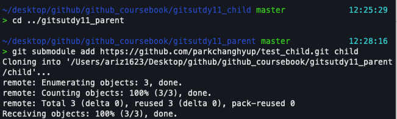    

출력 메시지를 
살펴보면 자식 저장소와 연결된 원격 저장소에서 복제(clone)를 시작한다. 부모 저장소에 서브 모듈을 등록하면 원격 저장소를 매개체로 자식 저장소를 복제한다.  

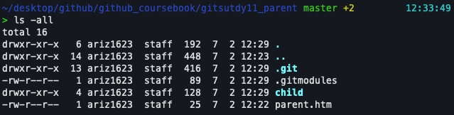      

저장소 파일들을 확인해 보니 서브모듈을 추가한 후 두 항목을 생성햇다. 첫 번째로 자식의 원격 저장소가 `child 폴더로 복제`되었고, 두 번째로 서브모듈의 설정 파일인 `.gitmodules가 추가 `되었다.    


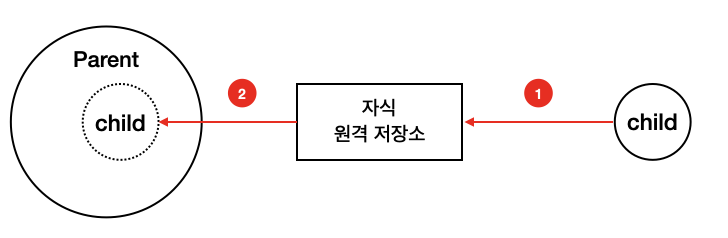      

### 설정 파일
처음으로 메인 저장소에 서브모듈이 등록되면 **깃은 루트 윛에 설정 파일을 생성**한다. 설정 파일은 메인 저장소와 연결된 자식 저장소들을 관리한다. 설정 파일 이름은 .gitmodules이다.  

설정 파일 내용을 살펴보자.  

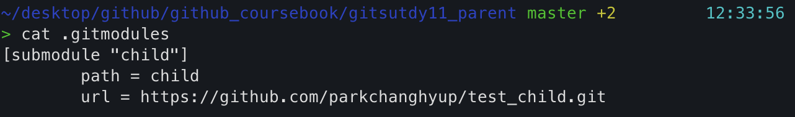       

환경 설정에는 서브모듈 이름과 URL이 기록되어 있다.    

### 모듈 커밋 
서브모듈 명령을 실행하여 메인 저장소에 자식 저장소를 연결했다. 서브모듈이 추가된 부모 저장소의 상태를 확인해 보자. status 명령어를 입력한다.  

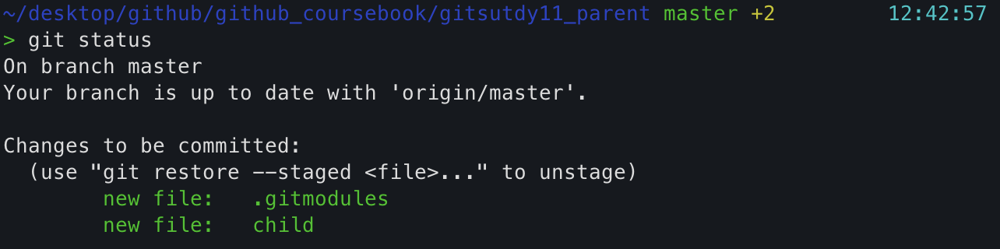         

메인 저장소와 서브모듈인 자식 저장소 간 **관계를 지속적으로 유지**하려면 추가된 정보들을 계속 가지고 있어야 한다. 메인 저장소가 자식들의 정보를 계속 가지려면 이를 **커밋하여 저장** 해야 한다.  

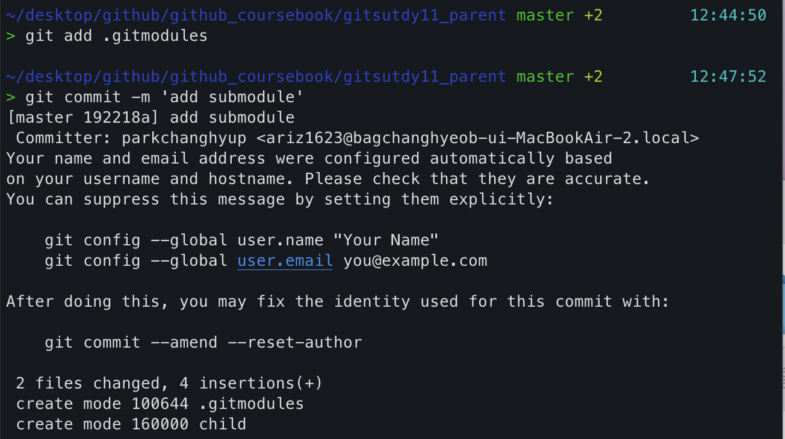         
부모 저장소에 `.gitsubmodules`를 커밋하여 자식들의 저장소 이력을 관리한다. 서브모듈은 자식들의 관계를 가지는 설정 파일을 포함하여 같이 배포한다.  

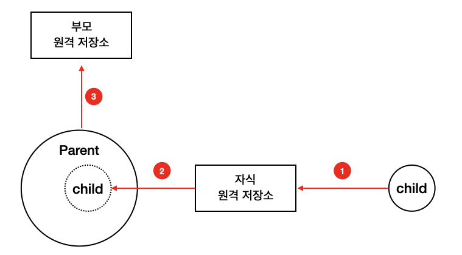           

금방은 자식들의 서브모듈 환경 설정 파일인 `.gitmodules` 파일만 등록하여 커밋했다. 복제된 자식 저장소는 커밋하지 않았다.  

## 서브모듈 작업  

메인 저장소를 서브 모듈 형태로 변경했다. 메인 저장소에는 서브 저장소의 연결 정보만 있다. 메인 저장소에 등록된 서브 저장소는 독립된 별도의 저장 공간이다.  

### 모듈 저장소   

독립된 자식 저장소에서 새롭게 작업을 해보자. 먼저 메인 저장소 내용을 확인해 보자.   

**child 폴더 안에 또 다른 숨긴 저장소인 .git 폴더**가 있다. 서브 폴더는 서브모듈로 분리한 독립 된 깃 저장소이다.  

### 모듈 상태
모듈로 등록된 자식 저장소를 수정해보자. 메인 저장소의child 폴더에서 child.htm 파일의 내용을 수정한다.  

child.htm  
```html
<h1>자식 저장소</h1>
<h2>child는 서브모듈입니다.</h2>
```   
파일을 수정한 후 서브 폴더 안에서 깃 상태를 확인해보자.  
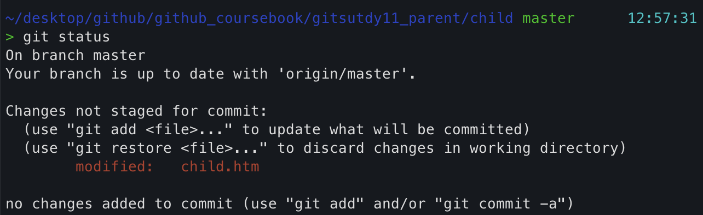  
child 폴더 안의 파일을 수정했다. 서브 폴더도 독립된 깃 저장소이기 때문에 status 명령어로 상태를 추적할 수 있다.  

이번에는 상위의 메인 저장소의 폴더로 이동해서 다시 상태를 확인해보자.   
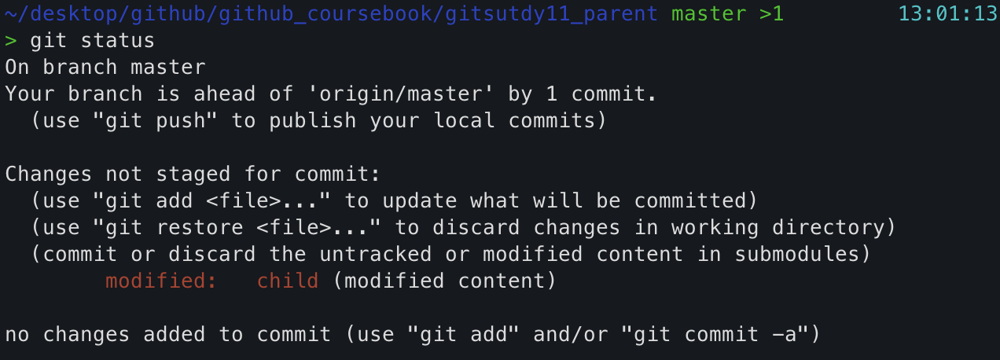    

**메인 저장소의 상위 폴더에서는 chuld 폴더만 변경했다고 출력한다** child 서브 폴더 안에서는 자식 저장소의 변경된 파일만 추적하고, 상위 메인 저장소에서는 서브모듈의 저장소 자체를 추적한다.  

### 모듈 커밋

`parent/child` 저장소의 내용을 수정 했다. 자식의 서브 폴더 저장소에서 수정한 내용을 커밋해보자. 

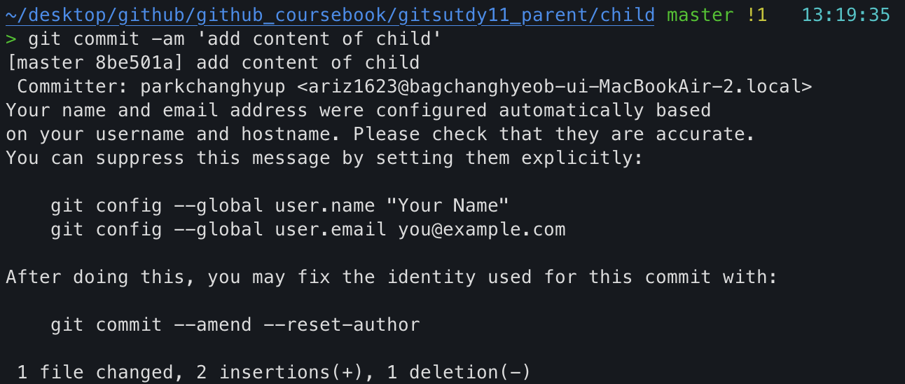    

이 커밋은 메인 저장소에서 하위로 복제 생성된 자식 저장소에만 커밋하는 것이다. 

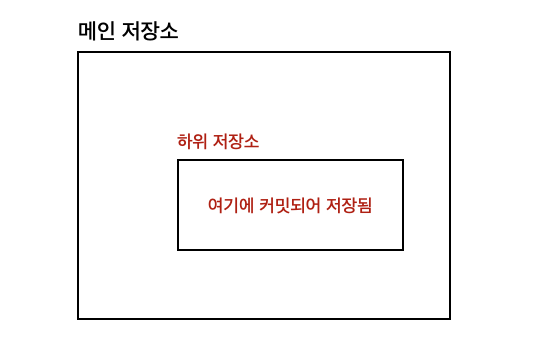      
커밋으로 메인 저장소 안에 있는 복제된 자식 저장소가 깨끗한 상태이다. 복제된 자식 저장소에만 커밋했을 뿐, 수정한 내용을 자식의 원격 저장소에는 아직 전송하지 않았다.   
parent/child에는 자식의 원격 저장소보다 앞선 커밋들이 있다.  
parent/child 폴더에서 원격 저장소 정보를 확인해보자.  

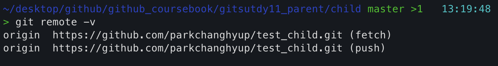        

서브모듈을 추가할 때 원격 저장소를 복제합니다. 복제할 때 원격 저장소의 정보들이 자동으로 설정된다. parent/child의 원격 저장소로 수정된 커밋을 푸시해보자

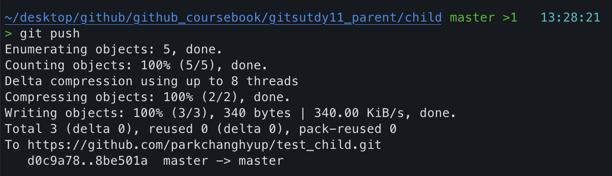        

parent/child 저장소에서 수정된 커밋을 원격 저장소로 전송했다. 다시 상태를 확인해 보자.  

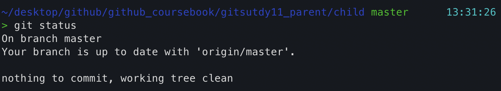        
parent/child와 자식의 원격 저장소를 모두 갱싱한 상태이다.  

### 부모 커밋  

parent/child 폴더의 저장소에서 수정 작업을 했다. 이제 상위 메인 저장소로 이동하여 부모 저장소의 상태를 다시 확인해보자.    

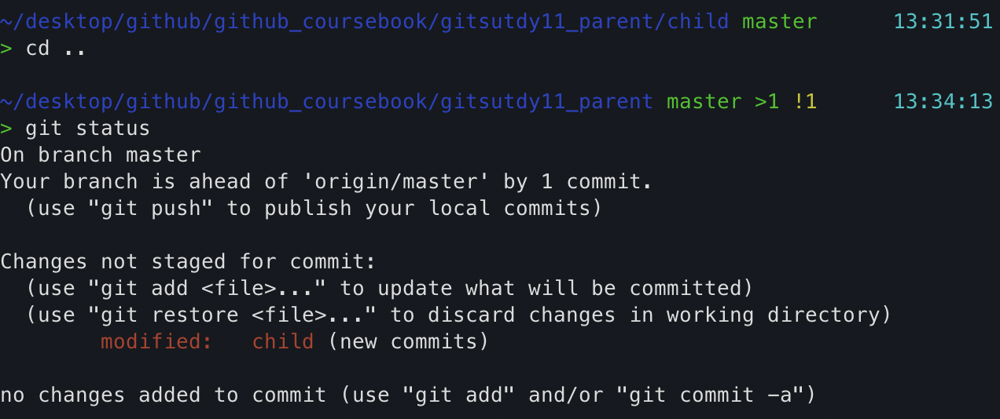        

메인 저장소를 살펴보니 child 폴더의 저장소가 변경된 상태를 가리킨다. 메인 저장소의 parent/child 폴더를 수정한 후 커밋했다면, 메인 저장소의 서브 모듈도 변경된다.  
이 변경 사항을 커밋하여 기록한다. 메인 저장소를 커밋하고 다시 상태를 살펴보자.  

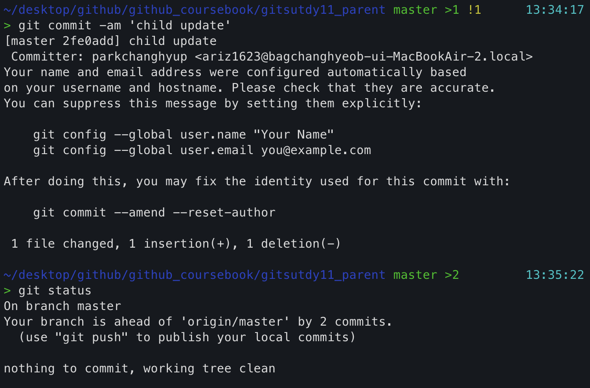          

커밋으로 변경된 사항을 기록했다. 메인 저장소도 변경된 커밋 때문에 원격 저장소로 미전송된 ahead가 남아 있다. 메인 저장소의 원격 저장소 목록을 확인해보자.  

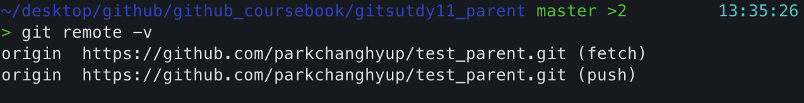            

부모 메인 저장소의 원격 저장소 주소가 출력 된다.  

메인 저장소의 커밋을 전송한다. 서브 모듈은 원격 저장소와 연결되어 있기 때문에 저장소마다 푸시해야 한다.  

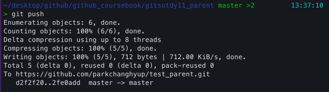              

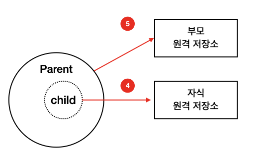            


## 자식 저장소 갱신

지금까지 한 작업은 메인 저장소에 복제된 parent/child 저장소에서만 작업했다. 수정된 parent/child 저장소의 커밋들은 원격 저장소와 동기화했다. 


### 자식 저장소  

자식 저장소와 메인 저장소에 등록된 저장소는 서로 다른 영역이다. 따라서 서로 다른 두 저장소는 아직 동일한 커밋 정보를 가지고 있지 않다.   
자식 저장소에 연결된 원격 저장소를 이용하여 실제 자식 저장소를 최신 커밋 정보로 갱신해야 한다.   

### 자식 저장소 갱신

메인 저장소에 등록된 서브모듈(parent/child)의 커밋들은 자식의 원격 저장소로 푸시되었다.  

실제 자식 저장소에서 child.htm 파일 내용은 아래와 같다.  

```html
<h1>자식 저장소</h1>    
```

부모 저장소의 parent/child에서 수정된 내용을 실제 자식 저장소에는 반영하지 않았다. 자식 저장소의 원격 저장소를 이용하여 갱신하자.  

다시 child.htm 파일을 확인하면, 부모 저장소의 parent/child에서 수정한 작업들이 실제 자식 저장소에도 적용되었다.  

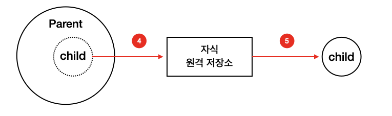            

```html
<h1>자식 저장소</h1>    
<h2>child는 서브모듈입니다.</h2>    
```    


### 자식 저장소 작업  

지금까지는 메인 저장소에서 복제한 자식 저장소(parent/child)에서 수정 작업을 했다. 그리고 수정 내역의 커밋을 자식 저장소의 원격 저장소를 거쳐 실제 자식 저장소에 반영했다.  
이번에는 반대로 실제 자식 저장소에서 코드를 수정하고, 이를 자식 저장소의 원격 저장소를 거쳐 부모 저장소의 서브모듈(parent/child)로 적용해보자.  

먼저 실제 자식 저장소를 수정하고 커밋, 푸쉬 한다.  


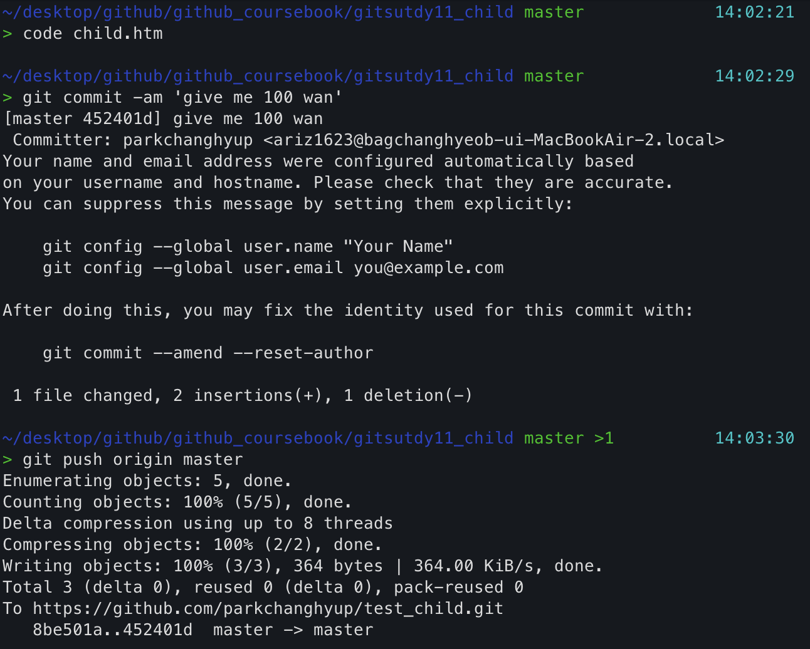             

### 부모 저장소 적용
실제 자식 저장소에서 변경한 커밋을 메인 저장소의 서브모듈(parent/child)에 반영해보자.  로컬 저장소의 부모 저장소로 이동한다.  

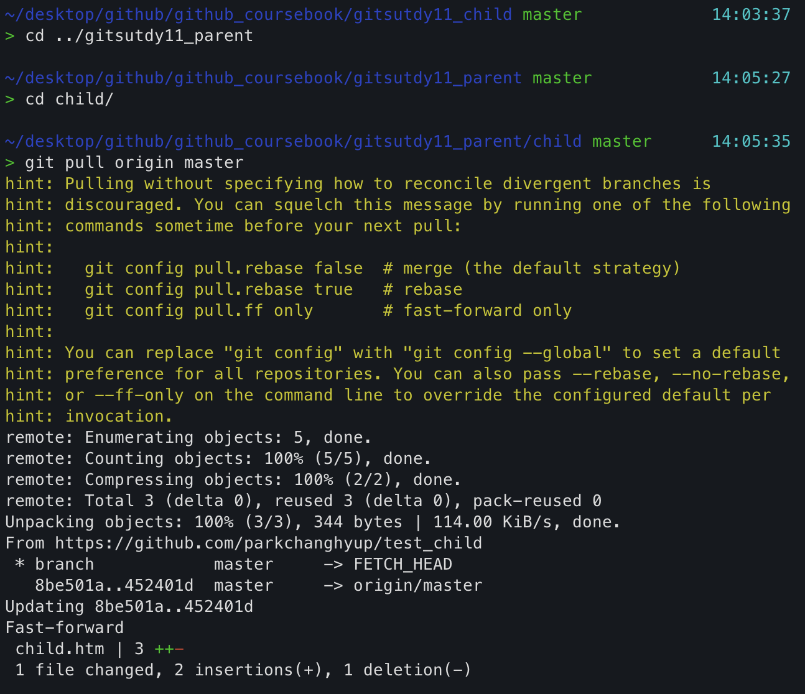          

### 부모 저장소 갱신

자식 저장소의 원격 저장소를 이용하여 메인 저장소의 서브모듈을 갱신했다.  
 
서브모듈을 갱신하면 메인 저장소는 자신의 서브 폴더가 변경된 것을 인식한다.  


부모 폴더로 이동해서 상태를 확인해 보자. 

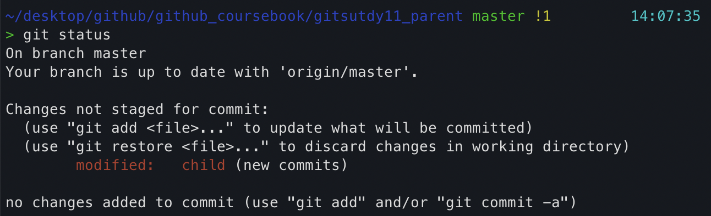          

즉, **메인 저장소는 서브모듈의 변경 내용을 모니터링하고 있는 것이다.** 메인 저장소의 서브 폴더 자체를 변경했기 때문에 변경된 내용을 다시 메인 저장소로 커밋해야 한다.  

## 부모 저장소 복제  
서브모듈로 구성된 저장소는 부모/자식 관계를 맺는다. 서브모듈의 저장소를 복제하거나 배포할 때는 부모/자식 관계도 같이 복제해야 한다.  

### 부모 저장소 복제
새로운 실습을 위해 clone 명령어를 실행하여 메인 저장소를 복제한다.  

gitstudy11은 부모/자식 관계인 서브모듈 형태로 되어 있다. 현재는 메인 저장소만 복제했으며, 그림으로 나타내면 다음과 같다.  

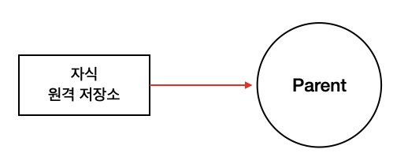          

### 모듈 업데이트

메인 저장소를 복제할 때는 서브모듈 정보만 같이 복제할 뿐, 실제 하위 저장소는 같이 복제하지 않는다. 서브모듈의 하위 저장소는 직접 명령어를 실행하여 가져와야 한다. 하위 저장소의 내용을 가져오려면 먼저 초기화와 갱신 작업을 해야 한다.   
 
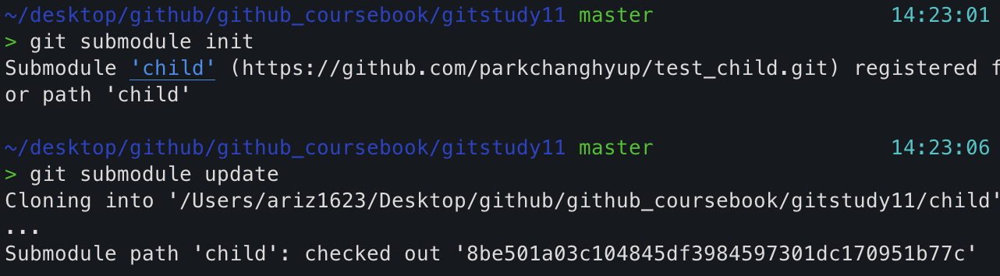          

서브 모듈 update 옵션으로 관련 화위 저장소를 복제한다.  

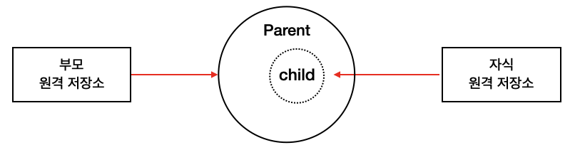            

서브모듈 초기화와 업데이트를 진행했다. 다시 폴더 내용을 확인해 보자.  
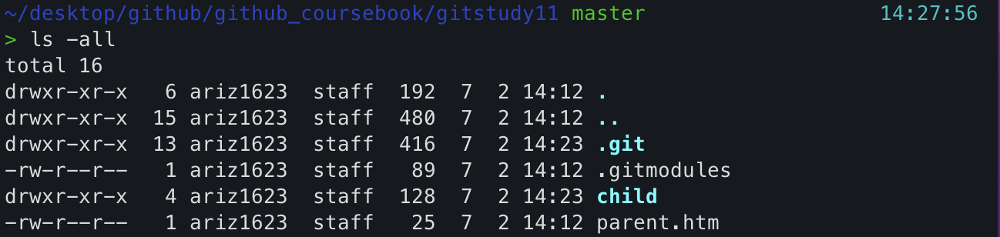            
서브모듈 child 폴더에 복제한 하위 저장소 내용이 추가되었다.  
깃 배시에서 서브 저장소의 브랜치 이름을 주의 깊게 살펴보자. 브랜치 이름이 master가 아닌 8be501a0로 되어 있다.   
서브모듈을 업데이트할 때는 메인 저장소의 비어 있는 서브모듈 커밋 위치를 리모트 체크아웃 한다.   

## 부모 저장소 업데이트  

메인 저장소는 서브모듈 형태로 구성되어 있다. 부모 저장소도 별도로 관리하므로 갱신이 필요하다.   
### 부모 업데이트 
서브모듈 형태로 구성된 부모/자식 저장소도 커밋을 갱신한다. 새로운 하위 저장소를 추가하거나 하위 저장소를 갱신할 때 메인 저장소의 설정 파일과 폴더가 변경되기 때문이다.  
따라서 자식 저장소에 코드 수정으로 커밋이 발생하면, 부모에도 자연스럽게 새로운 커밋이 발생한다.  
갱신된 메인 저장소 내용을 정기적으로 갱신하여 서브모듈 상태를 최신으로 유지해야 한다.  

## 부모 저장소로 풀  
하위 저장소에 새로운 커밋이 생성되면 메인 저장소는 이를 반영한다. 메인 저장소에는 반영한 하위 저장소의 변경된 내용 때문에 추가 커밋이 발생한다.  
자신이 메인 저장소를 복제하여 운영하고 있다면, 메인 저장소를 주기적으로 풀(pull) 작업해 주어야 한다.    

`$ git pull origin master`  
하지만 부모 저장소를 풀했다고 해서 부모 저장소에 종속된 모드 서브 저장소까지 자동으로 갱신되지는 않는다.  다음과 같이 서브모듈의 업데이트는 별도로 명령어를 실행해 주어야 한다.  

`$ git submodule update`   

## 정리
서브모듈은 규모가 큰 저장소를 작은 저장소 여러 개로 분리하여 운영할 수 있게 한다. 또 서브 모듈은 큰 프로젝트를 쪼개서 작은 프로젝트로 만들고, 저장소 크기를 줄여 가볍게 저장소를 운영할 수도 있다.  
서브모듈 형태로 코드를 분리하면 다른 프로젝트에서도 모듈을 재사용할 수 있는 장점이 있다. 또 각 모듈을 원격 저장소와 연결해서 협업하여 개발을 진행할 수도 있다. 