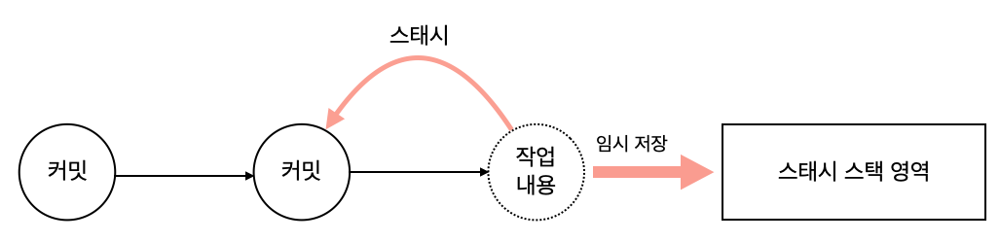
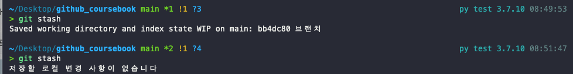
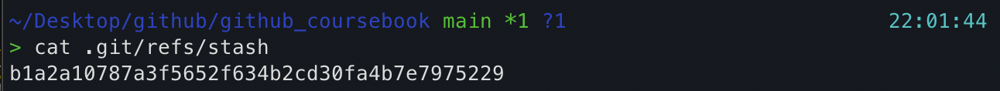
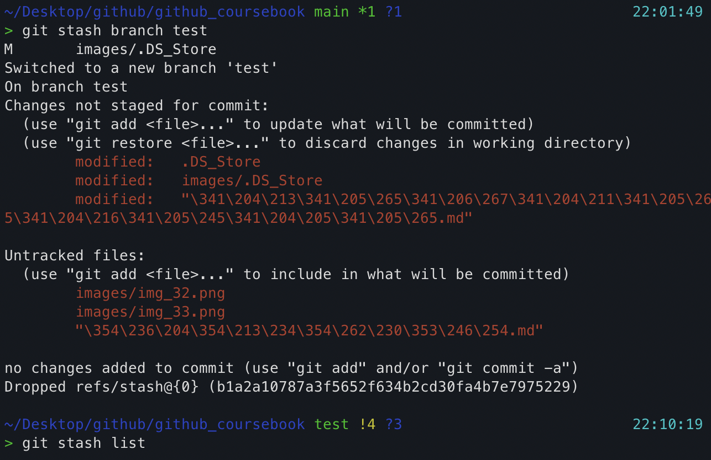
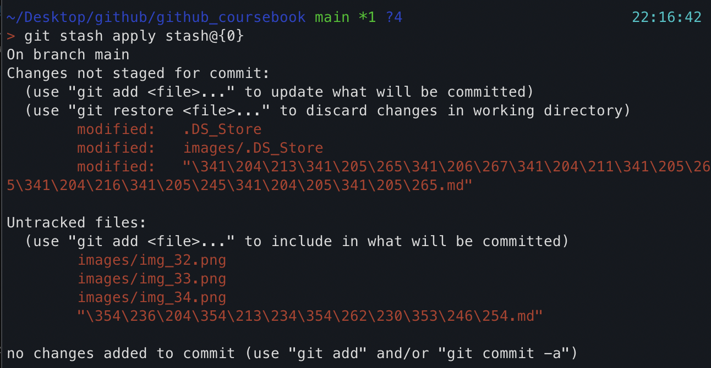
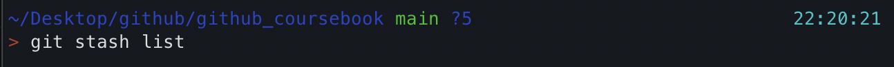

# 임시처리
## 스태시  
작업 브랜치를 변경하려면 워킹디렉터리는 깨끗한(clean)상태로 정리되어 있어야 한다.   
워킹 디렉터리에 작업 중인 내용이나 커밋되지 않은 변경 사항들이 남아 있으면 브랜치를 변경할 수 없다.  
예를 들어 브랜치에서 코드를 수정하는 도중에 새로운 버그가 발견되거나, 고객의 요청으로 코드를 추가하는 경우가 발생할 수 있다.  
하지만 현재 작업 중인 코드 역시 수정이 끝난 사항이 아닐때 `스태시`를 활용 할 수 있다. 스태시는 간단히 말해 `안전한 보관`이다.  

  

스태시는 **현재 워킹 디렉터리 내역을 별도 스택 영역에 잠시 보관하라**라는 명령이다.   
스태시는 브랜치를 이동할 때 작업 중인 내용 때문에 워킹 디렉터리가 충돌하는 것을 방지하는 데 사용한다.  

   

스태시 명령을 실행하면 현재 작업 중인 내용은 임시 저장되고, 수정 전 마지막 커밋 상태로 돌아간다. 즉, 이전 커밋 후 작업하지 않은 상태의 워킹 디렉터리가 된다.  

스태시를 하려먼 `stash 명령어`를 실행한다. 기본 명령어로 스태시를 실행하거나 옵션을 사용하여 추가 기능을 선택할 수 있다.   
스태시는 로컬 저장소에서만 사용 가능하다.    

스태시 명령어는 수정 중인 내역을 커밋하지 않고도 **브랜치를 이동할 수 있게 워킹 디렉터리를 깨끗이 청소**한다.  
따라서 커밋 대신 스태시 명령을 실행하면 된다. 스태시는 영구적인 커밋 기록 대신 **현재 작업들을 임시 스택 영역에 저장한다.  
간략하게는 `git stash` 명령어만 사용한다. 
또는 save 명령어를 추가하여 사용한다. git stash save 명령어는 스태시 여러 개를 생성할 때 유용하다.  
`$ git stash save`  
스태시는 스택 구조로 여러 번 실행하여 저장할 수 있다. 스태시가 여러 개 있을 때 각각의 스태시를 구별할 수 있도록 메지디도 추가할 수 있다.  

`$ git stash save "WIP: 메시지~~"`      

브랜치에서 스태시 명령을 실행하면 작업 중인 내역들을 스택에 저장하고 다시 한번 실행하면 워킹 디렉터리가 깨끗해진 것을 확인 할 수 있다.   

> 스태시 기능을 사용하지 않는다면 작업 중인 내용을 강제로 커밋한 후 다시 리셋해서 복원해야 한다. 이 작업은 복잡하므로 가능하면 스태시 기능을 사용하는 것이 좋다.  

스태시 작업을 할 때 스테이지 영역의 파일들을 제외할 수도 있다. `--keep-index 옵션`을 사용하면 스케이지 영역의 파일들을 제외하고 스태시를 만든다. 또 스태시는 드올괻ㄴ 파일들만 스태시로 생성한다. 등록되지 않은 untracked 사ㅇ태의 파일을 스태시로 생성하고 싶다면 `--include-untracked` 옵션을 같이 사용한다.  

### 임시 저장 영역의 스택 목록  
스태시의 저장 영역은 스택 구조이다. 스택은 **마지막에 입력한 자료가 제일 먼저 출력되는 데이터 저장 방식**이다.  

스태시에 저장된 스택은 list 옵션을 사용하여 확인할 수 있다.  

`$ git stash list`  
깃은 스태시된 객체들을 `.git/refs/stash`에 저장한다. 다음 예처럼 저장된 스태시 객체에서 cat 명령어로 내용을 확인할 수 있다.  

  
스태시 이름은 `stash@{번호}` 형태로 순차적으로 부여된다. 목록 번호는 0부터 시작한다.

### 임시 저장한 스태시 불러오기  

스태시를 사용하는 목적은 현재 워킹 디렉터리를 커밋하지 않고 임시로 저장하기 위해서이다.  
임시 저장된 내용은 다른 수정 작업을 완료한 후에 다시 불러와 사용할 수 있다. 스태시 명렁어 뒤에 `pop`옵션을 추가하면 된다.    

`$ git stash pop`  
스태시는 저장 공간이 스택구조이다. 따라서 스택에서 저장된 작업 내용을 읽어 올 때는 **제일 마지막에 저장된 내용을 읽어**온다.  

### 스태시 복원으로 충돌
스태시를 복원할 때 워킹 디렉터리의 상태는 깨끗해야한다. 스택에 저장된 스태시 내용이 다시 워킹 디렉터리로 복구될 때, 수정된 작업 내용과 현재 워킹 디렉터리를 병합하기 때문이다.  
복구되는 브랜치의 워킹 디렉터리가 깨끗하지 않다면 병합 과정에서 충돌이 발생할 가능성이 많다.  

특히 스태시를 복원할 때 같은 파일에서 동일한 부분을 변경했다면 즉시 충돌이 발생한다. 스태시를 복원할 때 충돌이 생기면 직접 문제를 해결해야 한다.  **복원하는 도중 충돌이 생기면 스태시는 스택에 저장된 내용을 자동으로 삭제하지 않는다.**  직접 충돌을 해결한 후 스태시 목록을 수동으로 삭제해야 한다. 스태시 충돌이 예상된다면 스태시용 브랜치를 하나 생성해서 작업하는 것을 추천한다.  

다음은 새로운 브랜치를 생성한 후 스태시를 적용하는 명령어 이다.  

`$ git stash branch 브랜치이름`  

img  

새로운 브랜치 생성과 동시에 스태시의 임시 작업 내용을 복원했다. 다시 스태시 명령을 실행해 스택 목록을 확인해보면 목록이 비어 있는것을 확인할 수 있다.    

### 스태시 복사

스태시 스택에 저장된 항목들은 어느 브랜치에서나 복원이 가능하다.  `apply`옵션은 스택에 저장된 항목을 불러와 현재 브랜치로 복원한다.  

`$ git stash apply`  
스태시 복원은 pop, apply 명령어 2개를 제공한다. 두 명령에어는 차이가 있는데, 스태시의 **pop 명령어는 스택 내용을 복원한 후 스택목록에서 자동으로 삭제**한다.  
즉, pop 명령어는 스택 내용을 워킹 디렉터리로 **이동**하는 것과 같다.  하지만 스태시 복원을 하고 난 후 스택 목록을 삭제하고 싶지 않을 때도 있다.   
이때 **apply 옵션**을 사용한다. 스택 목록을 읽은 후 자동으로 삭제하지 않기 때문이다.  apply명령어는 스태시 내용을 워킹 디렉터리로 **복사**하는 것과 같다.  

  

선택한 스택을 읽어와 현재 브랜치의 워킹 디렉터리로 복원했다. 다시 스태시 목록을 확인해보면,  아무것도 없는 것을 알 수 있다.    

  

### 스태시 삭제

스태시는 복월할 때 한 번 호출하면 자동으로 스택에서 삭제된다. 하지만 충돌이 발생하거나 apply 명령어로 워킹 디렉터리를 복구할 때는 스텍에서 자동으로 삭제되지 않는다. 이때는 별도 명령을 실행해야만 스태시 목록에서 삭제된다.  

`$ git stash drop`  

## 워킹 디렉터리 청소
개발하는 과정에서 컴파일 등 임시로 생성되는 파일들이 생긴다. 이 파일들은 `.gitignore` 목록에 넣어 관리할 수도 있지만, 반복해서 불필요하게 생성되는 파일들은 귀찮을 뿐이다.  
이때 `clean 명령어`를 사용하면 **워킹 디렉터리에 있는 추적되지 않는 파일들을 찾아 삭제**한다.  

`$ git clean`   

## 정리  
깃을 안정적으로 잘 사용하려면 워킹 디렉터리를 항상 깨끗하게 유지 관리해야한다. 워킹 디렉터리는 코드를 생성하고 수정하는 모든 작업 공간이다. 워킹 디렉터리가 정리되어 있지 않으면, 브랜치를 변경하여 다른 작업을 할 수 없다.  

워킹 디렉터리를 정리하는 방법은 수정된 코드를 스테이지하고, 최종 스냅샷을 생성하여 커밋하는 것이다.  커밋하지 못할때는 스태시를 적용하여 작업 내용을 임시로 저장한 후 사용해야한다.  