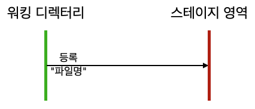
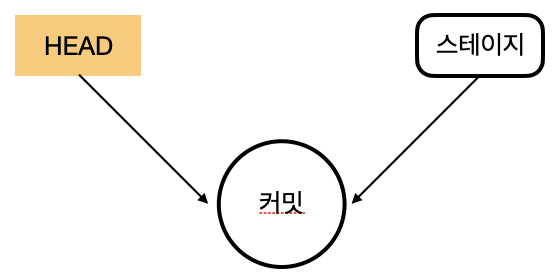
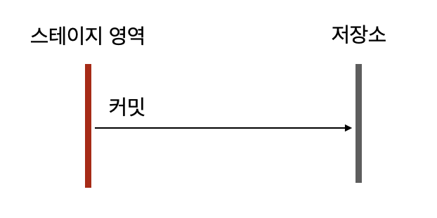

# 코드의 변화
## 파일 관리방법
깃의 커밋은 새로 변경된 부분만 추출하여 저장한다.   
그것도 파일 이름을 변경하지 않고도 동일한 파일 이름으로 하나로 관리가 가능하다.  
시간에 따라 변화되는 내용만 관리하고, 코드가 변화된 시간 순서에 따라서 영구적으로 저장한다. 이를 `커밋(commit)` 이라고 한다.    
커밋은 부모 커밋을 기반으로 변화된 부분만 새로운 커밋으로 생성한다. 그리고 커밋은 파일의 시간적 변화도 함께 저장한다.  

## 새 파일 생성 및 감지 
워킹 디렉터리에 새 파일이 추가되면 깃은 변화된 상태를 자동으로 감지한다.   
이때 깃 상태를 확인할 수 있는 명령어가 `status`이다.  
```python
> git status
현재 브랜치 master
브랜치가 'origin/master'에 맞게 업데이트된 상태입니다.

커밋하도록 정하지 않은 변경 사항:
  (무엇을 커밋할지 바꾸려면 "git add <파일>..."을 사용하십시오)
  (use "git restore <file>..." to discard changes in working directory)
	수정함:        .DS_Store

추적하지 않는 파일:
  (커밋할 사항에 포함하려면 "git add <파일>..."을 사용하십시오)
	커밋.md

커밋할 변경 사항을 추가하지 않았습니다 ("git add" 및/또는 "git commit -a"를
사용하십시오)
```
깃 배시 터미널로 실행하면 추적되지 않은 파일은 빨간색으로 표시한다. **"추적하지 않는 파일"** 메시지는 워킹 디렉터리에 새로운 파일이 등록되었다고 알려 주는 것이다.  
이렇게 깃은 워킹 디렉터리에 새 파일이 추가되면 상태를 감지하고 향후 이력을 추적할지 여부를 결정한다.   

## 깃에 새 파일 등록
워킹 디렉터리에 있는 파일은 깃이 자동으로 추적 관리 하지 않는다. 커밋을 하려면 **파일의 상태가 추적 가능**해야 한다.  


워킹 디렉터리는 작업을 위한 일종의 **샌드박스(서로 분리되어 있는 영역)** 와 같다.  

### 스테이지에 등록  
깃에서 등록이란 워킹 디렉터리에 있는 파일을 **스테이지(stage) 영역으로 복사**하는 것을 의미한다.  여기서 '복사'는 실제 파일을 복사하는 것을 의미하지 않는다.   
깃 내부에서 논리적인 기록을 변경하는 과정일 뿐이다.  
워킹 디렉터리에 추가된 모든 파일을 커밋할 때는 반드시 이 과정을 거쳐야 한다. 그래야 깃에서 버전 이력을 관리할 수 있다. 스테이지에 등록되지 않은 **unstage 상태의 파일들은 커밋할 수 없다.**  깃은 커밋하기 전에 파일들이 stage 상태인지 unstage 상태인지를 판단한다. 스테이지 영역으로 등록된 파일들은 tracked 상태로 자동 변경 된다. 

### 명령어로 등록 : add 명령어
현재는 커밋 명령어를 실행하기 이전의 중간 단계이다. 깃의 `add 명령어`는 워킹 디렉터리의 파일을 스테이지 영역으로 등록한다.   
깃은 안정적인 커밋을 할 수 있도록 add 명령어를 기준으로 이전과 이후 단계를 구분한다.  

```python
git add "파일명"
```

   

add 명령어를  실행하면 지정한 파일은 스테이지 영역으로 등록된다. 스테이지 영억에 파일이 **등록되면 파일은 tracked 상태로 변경** 된다.  
워킹 디렉터리에서 필요한 파일만 스테이지 영역에 등록하여 이력을 추적하면 된다.  
**스테이지 영역에 등록하지 않은 파일은 커밋 작업에 포함되지 않는다.** 또한 빈 폴더는 스테이지 영역에 등록할 수 없다.

### 파일의 추적 상태 확인
`git status` 명령어를 입력하면 아까와 달리 `새 파일` 메시지가 출력 되는데, 이는 스테이지 영역에 파일을 정상적으로 등록했다는 의미이다.
```python
> git status
현재 브랜치 master
브랜치가 'origin/master'에 맞게 업데이트된 상태입니다.

커밋할 변경 사항:
  (use "git restore --staged <file>..." to unstage)
	수정함:        .DS_Store
	새 파일:       images/img_6.png
	새 파일:       images/img_7.png
	새 파일:       커밋.md
```
### 파일 등록 취소  
이번에는 tracked 상태의 파일을 `untracked 상태`로 변경해보자.  등록 취소는 워킹 디렉터리와 스테이지 영역을 서로 왔다 갔다 할 수 있는 방법이다. 
unstage 상태로 변경하려면 `삭제(rm)`나 `리셋(reset)` 명령어를 사용한다. 

   
먼저 rm 명령어로 삭제해 보면, 스테이지 영역에서만 등록된 파일을 삭제하려고 `--cached`옵션을 함께 사용한다.
```python
> git rm --cached 커밋.md
rm '커밋.md'
```
git status 를 통해 상태를 확인해보면 untracked로 변경된 것을 알 수 있다.

```python
> git status
현재 브랜치 master
브랜치가 'origin/master'에 맞게 업데이트된 상태입니다.

커밋할 변경 사항:
  (use "git restore --staged <file>..." to unstage)
	수정함:        .DS_Store
	새 파일:       images/img_6.png
	새 파일:       images/img_7.png

추적하지 않는 파일:
  (커밋할 사항에 포함하려면 "git add <파일>..."을 사용하십시오)
	커밋.md
```
파일을 등록한 후 커밋하지 않고 바로 삭제하려면 `rm --cached`명령어를 사용한다. 하지만 **한번이라도 커밋을 했다면 `reset 명령어`를 사용**해야 한다.

커밋 후 삭제는 파일이 **삭제 또는 변화된 것으로 간주**한다. 따라서 커밋된 파일은 리셋으로 삭제한 후 정리해 주어야 한다. 

## 첫 번째 커밋
지금까지 한 작업은 커밋의 준비 작업들이다. 이번에는 스테이지 영역에 등록된 파일들을 커밋해서 기록하는 과정을 알아보자.  
### HEAD
커밋을 학습하기 전에 HEAD 개념을 하나 더 알아보자. 깃에는 `HEAD`라는 **포인터** 개념이 있다. HEAD는 커밋을 가리키는 묵시적 참조 포인터다.  
   

HEAD는 최종적인 커밋 작업의 위치를 가리킨다. 처음 커밋할 때는. HEAD의 포인터가 없다. 최소한 한 번 이상 커밋을 해야만  HEAD가 존재한다.  

### 스냅샷
커밋은 파일 변화를 깃 저장소에 **영구적**으로 기록한다.  깃이 다른 버전 관리 도구와 다른 점은 `스냅샷`방식을 이용한다는 것이다.   
파일을 복사하는 방식으로 수정본을 관리하면 같은 내용을 반복해서 저장하기에 많은 용량을 차지 한다.    
또 수정된 부분들을 일일이 찾아야 하기 때문에 검색할 때도 매우 불편하다.  
깃은 이러한 시스템적인 단점을 해결하려고 변경된 파일 전체를 저장하지 않고, 파일에서 변경된 부분을 찾아 수정된 내용만 저장한다. 마치 변화된 부분만 찾아서 사진을 찍는 것과 같다고 하여 스냅샷 방식이라고 한다.  

   
깃의 스냅샷은 HEAD가 가리키는 커밋을 기반으로 사진을 찍는다. 그리고 이를 스테이지 영역과 비교하여 새로운 커밋으로 기록한다.  
이처럼 깃은 스냅샷 방식을 이용하여 **빠르게 버전의 차이점을 처리하고, 용량을 적게 사용**한다.


### 파일 상태와 커밋
커밋은 변화된 내용을 영구적으로 깃 저장소에 기록한다. 새롭게 생성된 파일을 커밋하려면 **반드시 tracked 상태로 변경** 해 줘야 한다.  
tracked 상태로 파일이 변경됨과 동시에 스테이지 영역에 등록합니다.  

<br/>  
 
tracked 상태인 파일을 수정하면 다시 modified 상태로 변경된다. `modified는 untracked 상태`이다.  
untracked 상태의 파일은 반드시 등록 명령으로 다시 스테이지 상태로 재등록 해야한다. 재등록하면 다시 tracked 상태로 변경된다.      

커밋하기 전에는 status 명령어로 항상 상태를 확인하는 습관이 필요햐다. **워킹 디렉터리가 깨끗하게 정리되어 있지 않으면 커밋 명령어를 수행할 수 없다.**  

커밋을 하려면 스테이지 영역에 새로운 변경 내용이 있어야 한다.  수정된 내용이 스테이지 영역으로 등록되지 않으면 커밋을 할 수 없다. 커밋은 수정된 내용을 한 번만 등록한다. 스테이지 영역의 파일이 변경되지 않았다면 커밋을 두 번 실행 할 수 없다. 깃은 스테이지 영역의 변경된 내용을 기준으로 스냅샷을 만들어 커밋하기 때문이다.   


<br/>  


**명령어로 커밋**  
수정된 파일 이력을 커밋하려면 commit 명령어를 사용한다.  
`$ git commit`    
commmit 명령어는 독립적으로 사용할 수 있다. 또는 옵션을 추가하여 여러 동작을 같이 수행할 수도 있다.     

깃의 커밋은 HEAD와 스테이지 영역 간 차이를 비교하여 새로운 `객체를 생성`한다.  생성된 객체를 깃 저장소에 기록한다.  

  
> 커밋은 스냅샷을 이용하여 새로 수정된 파일과 디렉터리를 묶는 트리 객체이다. 커밋을 하면 새로운 트리 객체로 변환하는 것과 유사하다.  

<br/>  

**파일 등록과 커밋을 동시에 하는 법**
커밋을 하려면 반드시 워킹 디렉터리를 정리해야 한다. 즉, add 명령어로 추가되거나 수정된 파일등르 스테이지 영역에 등록해야 한다. 하지만 가끔씩 add 명령어를 미리 수행하는 것을 깜빡 잊을 때가 있는데, commit 명령어를 바로 수행하면 오류가 발생한다.  

이때 -a옵션을 commit 명령어와 같이 사용하면 이를 한 번에 해결할 수 있다.  
`$ git commit -a`  


## 커밋 확인
성공적으로 커밋을 했다면 이를 확인해 봐야 한다.  

### 스테이지 초기화  
먼저 터미널에서 status 명령어를 실행해서 상태를 확인한다.  

```
$ git status
On branch main
nothing to commit, working tree clean 
```
이전과 달리 **working tree clean 메시지**를 볼 수 있다. 커밋을 하면 스테이지 영역은 초기화된다.  더 이상 추가된 새로운 파일과 수정된 파일이 없다는 것이다.  

    
항상 커밋 전후에 status 명령어로 상태를 확인하는 것이 좋다.  

## 로그 기록 확인

커밋한 후 커밋 기록은 어떻게 확인할까? 깃은 커밋 목록을 확인할 수 있는 log 명령어를 별도로 제공한다.  

`$ git log`  
log 명령어는 시간 순으로 커밋 기록을 출력하는데, 최신 커밋 기록부터 **내림차순**으로 나열한다.  

커밋한 후에는 습관적으로 한 번씩 log 명령어를 실행하여 기록을 확인하는 것이 좋다. 또 log 명령어는 다양한 커밋 기록을 확인 할 수 있도록 여러 옵션을 제공한다. 
## 두 번째 커밋  
### 파일 변경 사항 확인
파일을 간단히 수정하고 변경된 파일을 깃이 어떻게 감지하는지 알아보자.   
터미널에서 status 명령어를 실행 시켜 보면 아래와 같이 출력 된다.
    

어떤 파일이 변경되었고 어떻게 수정 됐는지 자세히 알 수 있습니다.  
### 수정된 파일 되돌리기  
위에서 보았듯이 파일을 수정하면 modified 상태로 변경된다. 하지만 수정하는 과정에서 파일을 잘못 수정할 수도 있다. 파일을 수정전 상태로 되돌리려면 어떻게 해야할까?  
깃을 이용하면 수정한 파일을 커밋 전 마지막 내용으로 쉽게 되돌릴 수 있다. 바로 이전 커밋으로 되돌리는 명령어는 다음과 같다.  

`$ git checkout -- 수정파일 이름`